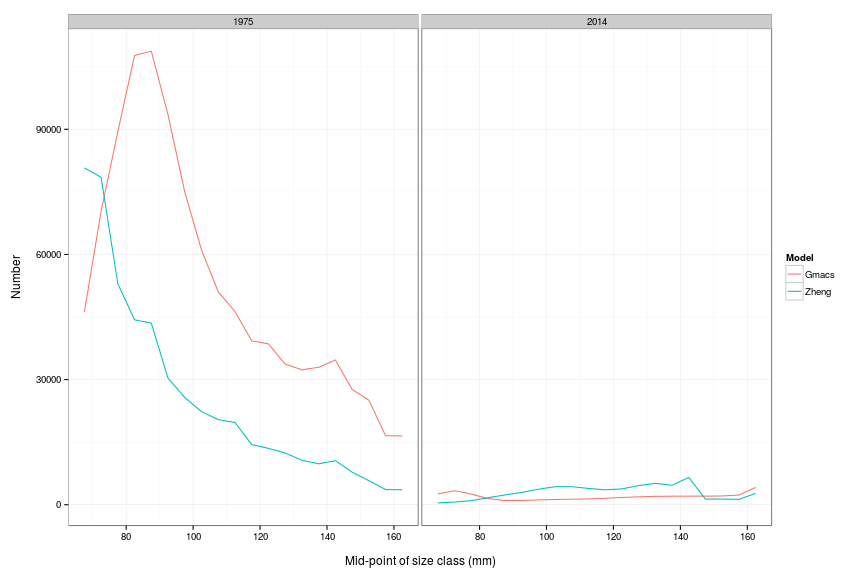
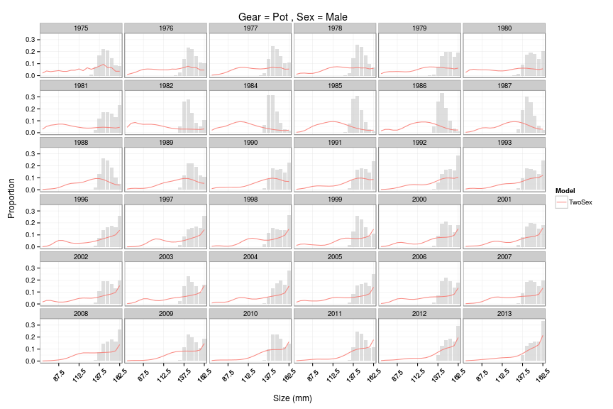
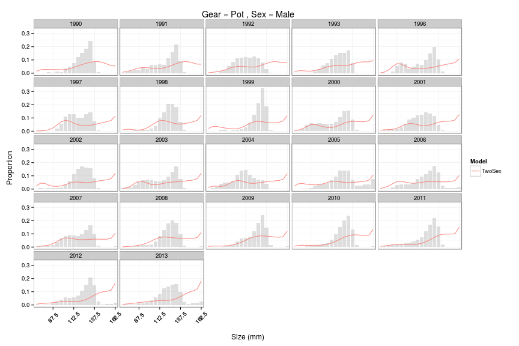
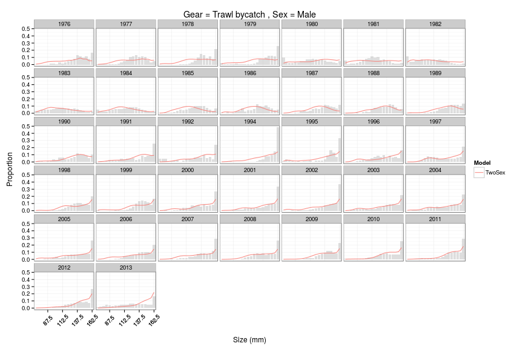

## Introduction

Gmacs is a generalized size-structured stock assessment modelling framework for
molting crustacean species. Gmacs can make use of a wide variety of data,
including fishery- and survey-based size-composition data, and fishery-dependent
and -independent indices of abundance. Gmacs is coded using AD Model Builder.

Crab stocks of Alaska are managed by the North Pacific Fisheries Management
Council ([NPFMC](http://npfmc.org)). Some stocks are assessed with integrated
size-structured assessment models of the form described by
@punt_review_2013. Currenlty, each stock is assessed using a stock-specific
assessment model (e.g. @zheng_bristol_2014). The Gmacs project aims to provide
software that will allow each stock to be assessed inside a single modelling
framework.

Gmacs is used here to develop an assessment model for the Bristol Bay Red King
Crab (BBRKC) stock. This analysis serves as a test-case for the development of
Gmacs: the example assessment is intended to match closely with a model scenario
presented to the Spring 2014 BSAI Crab Plan Team Meeting by @zheng_bristol_2014.

Together, the Gmacs-BBRKC model and this report serve as the first example of
what should follow for other crab stocks: that is, direct model comparisons to
(1) test the efficacy of Gmacs, and (2) determine whether Gmacs can be used in
practice to closely match the outputs of existing ADFG stock assessment models.

## Summary of analytical approach

Information here on the model, the history, and specifications (current and
old).

### ADFG-BBRKC

To reduce annual measurement errors associated with abundance estimates derived
from the area-swept method, the ADFG developed a length-based analysis (LBA) in
1994 that incorporates multiple years of data and multiple data sources in the
estimation procedure (Zheng et al. 1995a). Annual abundance estimates of the
BBRKC stock from the LBA have been used to manage the directed crab fishery and
to set crab bycatch limits in the groundfish fisheries since 1995. An
alternative LBA (research model) was developed in 2004 to include small size
groups for federal overfishing limits. The crab abundance declined sharply
during the early 1980s. The LBA estimated natural mortality for different
periods of years, whereas the research model estimated additional mortality
beyond a basic constant natural mortality during 1976-1993.

The original LBA model was described in detail by Zheng et al. (1995a, 1995b)
and Zheng and Kruse (2002). The model combines multiple sources of survey,
catch, and bycatch data using a maximum likelihood approach to estimate
abundance, recruitment, catchabilities, catches, and bycatch of the commercial
pot fisheries and groundfish trawl fisheries.

g. Critical assumptions of the model:

h. The base natural mortality is constant over shell condition and length and
was estimated assuming a maximum age of 25 and applying the 1% rule (Zheng
2005).

ii. Survey and fisheries selectivities are a function of length and were
constant over shell condition.  Selectivities are a function of sex except for
trawl bycatch selectivities, which are the same for both sexes. Two different
survey selectivities were estimated: (1) 1975-1981 and (2) 1982-2013 based on
modifications to the trawl gear used in the assessment survey.

iii. Growth is a function of length and did not change over time for males. For
females, three growth increments per molt as a function of length were estimated
based on sizes at maturity (1975-1982, 1983-1993, and 1994-2013). Once mature,
female red king crabs grow with a much smaller growth increment per molt.

iv. Molting probabilities are an inverse logistic function of length for
males. Females molt annually.

v. Annual fishing seasons for the directed fishery are short.

vi. Survey catchability (Q) was estimated to be 0.896, based on a trawl
experiment by Weinberg et al.  (2004) with a standard deviation of 0.025. Q was
assumed to be constant over time. Some scenarios estimate Q in the model.

vii. Males mature at sizes =120 mm CL. For convenience, female abundance was
summarized at sizes =90 mm CL as an index of mature females.  viii. For summer
trawl survey data, shell ages of newshell crabs were 12 months or less, and
shell ages of oldshell and very oldshell crabs were more than 12 months.

ix. Measurement errors were assumed to be normally distributed for length
compositions and were log- normally distributed for biomasses.

h. Changes to the above since previous assessment: see Section A.3. Changes to
the assessment methodol- ogy.

i. Outline of methods used to validate the code used to implement the model and
whether the code is available: The code is available.

3. Model Selection and Evaluation

a. Alternative model configurations: Several scenarios were compared for this
report: Scenario 4: base scenario. Scenario 4 includes:

(1) Basic M = 0.18, and additional mortalities as one level (1980-1984) for
males and two levels (1980-1984 and 76-79 & 85-93) for females.

(2) Including BSFRF survey data in 2007 and 2008.

(3) Assuming survey catchability to be 0.896 for all other years.

### Gmacs-BBRK

How Gmacs deals with retention and selectivity: this is an important part to
add, as there.

## Comparison of Data and Model Specifications

### ADFG
### Survey Data

### Catch Data

### Weight and Fecundity

For the length-weight relationships, Jie's data file `rk7513s1.dat` has
information on the weight-at-length parameters for BBRKC. He suggests we use the
'new' parameters listed (see line 339 onwards): these parameters were estimated
by NMFS.
 
Fecundity-at-length is a little more complicated: This information was provided
by Jie:

From Jie: Fecundity-at-length depends on clutch fullness, which changes from
year to year. Right now, we do not use fecundity in the management, so no
fecundity is used in the model. The “fecundity” used in Andre's simplified model
looks like the male mean weight by length with the “old" parameters”. If GMACS
needs fecundity, maybe just input mean weight by length of mature females, or
mature males (please use “new” parameters). As to the maturity by length, right
now, it is 0 for lengths less than 90 mm and 1 for lengths 90 or larger for
females and 0 for lengths less than 120mm and 1 for lengths greater than 119 mm
for males. In the future, I plan to estimate maturity by length for females over
time to improve estimation of growth.

### Gmacs

The data and model specifications used in the Gmacs-BBRKC model are very similar
to those used in the '4nb' scenario developed by @zheng_bristol_2014, herein
referred to as the ADFG-BBRKC model.

Parameterization of the Bristol Bay red king crab.

Parameter Number of estimated parameters Value Natural mortality 1 Males (1980-84) 1 Females (1980-84) 1
Females (1976-79; 1984-1993) 0.18 yr-1 Other years

Growth
Transition matrix Pre-specified Molt probability (slope and intercept) (1975-78) Females? 2 Molt probability
(slope and intercept) (1979+) Females? 2 Molt probability (slope and intercept) Males? Pre-specified

Recruitment
Gamma distribution parameters 4 Annual deviations ??

Fishing mortality
Mean fishing mortality (directed fishery) 1 Annual fishery deviations (directed fishery) ??
Mean fishing mortality (groundfish fishery) 1 Annual fishery deviations (groundfish fishery) ??
Mean fishing mortality (Tanner fishery) 1 Annual fishery deviations (Tanner fishery) ??

Fishery selectivity
Directed fishery slope and intercept (by sex) 4 Groundfishery slope and intercept (both sexes) 2 Tanner crab
fishery slope and intercept (both sexes) 4 Retention
Slope, inflection point, asymptote 3 Initial conditions ??
Survey catchability 1 Survey selectivity
NMFS Slope and intercept (1975-81) by sex 4 NMFS Slope and intercept (1982+) by sex 4 BSFRF selectivity
Pre-specified BSFRF CV 1

### Population Dynamics

Comparison tables of two different model approaches could be done by

Specification       | Parameter | ADFG Value | Gmacs Value | Comments
------------------  | --------- | ---------- | ----------- | --------
No. sexes           | M         | 2          | 2           | 
No. shell condition | M         | 2          | 2           | 
No. maturity        | M         | 2          | 1           | 
No. size-classes    | M         | 20         | 20          | 

Life History Trait  | Parameter | ADFG Value | Gmacs Value | Comments
------------------  | --------- | ---------- | ----------- | --------
Natural Mortality   | M         | Fixed      | Fixed       | M is fixed in both models

### Fishery Dynamics

Specification       | Parameter | ADFG Value | Gmacs Value | Comments
------------------  | --------- | ---------- | ----------- | --------
No. Fleets          |           | 5          | 2           |
No. Fleets          |           | 5          | 5           |

There are five separate fishing fleets accounted for in the ADFG model:

## Comparison of Model Results

The results of the ADFG-BBRKC model are compared here to the results of the
Gmacs-BBRKC model.

The length-weight relationship used between the two models differs somewhat
(Figure \ref{fig:length-weight}).

 

The fit to the NMFS surveys also differ (Figure \ref{fig:survey_biomass}). The
ADFG-BBRKC model provides as bad a fit to the female survey biomass as the
Gmacs-BBRKC model. However, the ADFG-BBRKC model provides a much better fit to
the male survey biomass.

 

In both the ADFG-BBRKC and Gmacs-BBRKC models, time-varying natural mortality
($M_t$) is freely estimated with four allowed step changes through time. The
pattern in time-varying natural mortality is resonably similar between the two
models (Figure \ref{fig:Mt}), however the peak in natural mortality during the
early 1980 is not as high in the Gmacs-BBRKC model.

 

Recruitment patterns are similar, but differences in natural mortality schedules
will affect these matches (Figure \ref{fig:recruitment}).

 

The number of crabs in each size class in the initial and final years of each
model differ substantially (Figure \ref{fig:numbers}).

 

The spawning stock biomass ($\mathit{SSB}_t$) of mature males also differs a lot bewteen the two
models (Figure \ref{fig:ssb}).

 

### Gmacs Results

We need to be able to produce a table of the comparative likelihoods (by
component) of the alternative models. For best practice, just try and do what we
do with SS models for SESSF stocks anyway. See the pink link report, and enter a
section for each of those, and see if we can emulate a report of that type.

In what follows, we demonstrate the use of the `gmr` package to process the
output of the Gmacs-BBRKC model and produce plots that can be used in assessment
reports.

The fit of the Gmacs-BBRKC model to the catch (Figure \ref{fig:catch}).

 

The selectivity by length ($S_\ell$) for each of the fisheries (Figure \ref{fig:selectivity}).

 

The size transitions (Figure \ref{fig:size-trans}).

 

The growth increments (Figure \ref{fig:growth-inc}).

 

The fit of the model to the size composition data (Figure
\ref{fig:sc_pot_m}). In the groundfish trawl bycatch fisheries for males
(Figure \ref{fig:sc_trawl_bycatch_m}) and females (Figure
\ref{fig:sc_trawl_bycatch_f}).

 

 

 

 

 

 

## Comparison of Assessment Processes

### File Description

  * The `*.tpl` file is working, it builds and the `*.exe` file runs successfully.
  * The main `*.dat` file is read in as expected (comments within).
  * There is a second data file `rksize13s.dat` with sample sizes for 
    various rows of size-comp data. See lines 81-87 of `*.tpl`. 
  * Input sample sizes appear to be capped to the constant numbers entered in 
    the main data file under 'number of samples' or 'sample sizes' (variously).
  * There is a third data file `tc7513s.dat` specifically for data from the
    tanner crab fishery (with red crab bycatch).
  * There is a standard control file `*.ctl` with internal comments.
  * There is an excel spreadsheet which can be used to read in the model
    output files and display related plots (it's a bit clunky).
  * There are two batch files in the model directory: `clean.bat` and `scratch.bat`.
    The 'clean' batch file deletes files related to a single model run. The
    'scratch' batch file deletes all files relating to the model build and 
    leaves only source and data files.

## Discussion

This discussion will focus on the challenges in developing a Gmacs version of
the BBRKC model: those met, and those yet to be met.

## References
