## Introduction

Gmacs is a generalized size-structured stock assessment modeling framework [more
here on Gmacs]. Crab stocks of Alaska are managed by the North Pacific Fisheries
Management Council [NPFMC](http://npfmc.org). Some stocks are assessed with
integrated size-structured assessment models of the form described by
@punt_review_2013. Currenlty, each stock is assessed using a stock-specific
assessment model. The Gmacs project aims to provide software that will allow
each stock to be assessed inside a single modelling framework.

Gmacs is used here to develop an assessment model for the Bristol Bay Red King
Crab (BBRKC) stock. This analysis serves as a test-case for the development of
Gmacs: the example assessment is intended to match closely with a model scenario
presented to the Spring 2014 BSAI Crab Plan Team Meeting by @zheng_bristol_2014.

Together, the Gmacs-BBRKC model and this report serve as the first example of
what should follow for other crab stocks: that is, direct model comparisons to
(1) test the efficacy of Gmacs, and (2) determine whether Gmacs can be used in
practice to closely match the outputs of existing ADFG stock assessment models.

## Summary of analytical approach

Information here on the model, the history, and specifications (current and
old).

### ADFG-BBRKC

### Gmacs-BBRK

How Gmacs deals with retention and selectivity: this is an important part to
add, as there.

## Comparison of Data and Model Specifications

### ADFG
### Survey Data

### Catch Data

### Weight and Fecundity

For the length-weight relationships, Jie's data file `rk7513s1.dat` has
information on the weight-at-length parameters for BBRKC. He suggests we use the
'new' parameters listed (see line 339 onwards): these parameters were estimated
by NMFS.
 
Fecundity-at-length is a little more complicated: This information was provided
by Jie:

From Jie: Fecundity-at-length depends on clutch fullness, which changes from
year to year. Right now, we do not use fecundity in the management, so no
fecundity is used in the model. The “fecundity” used in Andre's simplified model
looks like the male mean weight by length with the “old" parameters”. If GMACS
needs fecundity, maybe just input mean weight by length of mature females, or
mature males (please use “new” parameters). As to the maturity by length, right
now, it is 0 for lengths less than 90 mm and 1 for lengths 90 or larger for
females and 0 for lengths less than 120mm and 1 for lengths greater than 119 mm
for males. In the future, I plan to estimate maturity by length for females over
time to improve estimation of growth.

### Gmacs

The data and model specifications used in the Gmacs-BBRKC model are very similar
to those used in the '4nb' scenario developed by @zheng_bristol_2014, herein
referred to as the ADFG-BBRKC model.

<!--- (check that the latesst gmacs-bbrkc model uses the data and specs of Jie's 4nb model). -->

Parameterization of the Bristol Bay red king crab

### Population Dynamics

Comparison tables of two different model approaches could be done by

Life History Trait  | Parameter | ADFG Value | Gmacs Value | Comments
------------------  | --------- | ---------- | ----------- | --------
Natural Mortality   | M         | Fixed      | Fixed       | M is fixed in both models

### Fishery Dynamics
Specification       | Parameter | ADFG Value | Gmacs Value | Comments
------------------  | --------- | ---------- | ----------- | --------
No. Fleets          |           | 5          | 5           |

There are five separate fishing fleets accounted for in the ADFG model:

## Comparison of Model Results

The results of the ADFG-BBRKC model are compared here to the results of the
Gmacs-BBRKC model.

### Gmacs Results

We need to be able to produce a table of the comparative likelihoods (by
component) of the alternative models. For best practice, just try and do what we
do with SS models for SESSF stocks anyway. See the pink link report, and enter a
section for each of those, and see if we can emulate a report of that type.

In what follows, we demonstrate the use of the `gmr` package to process the
output of the Gmacs-BBRKC model and produce plots that can be used in assessment
reports.

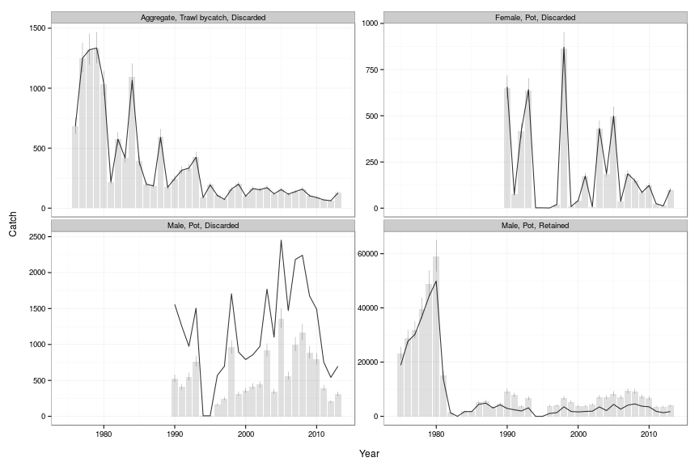 

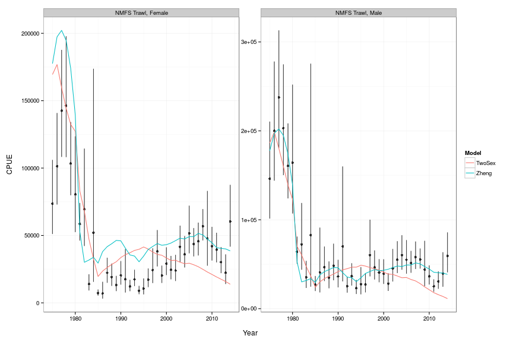 

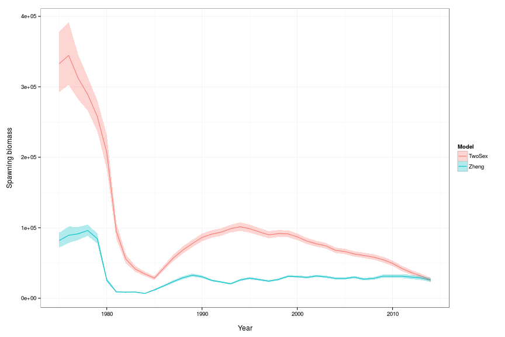 

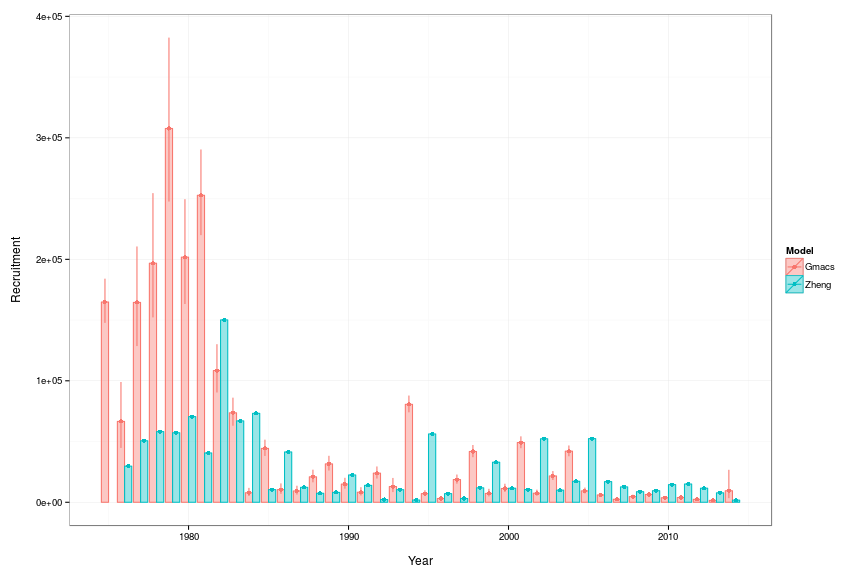 

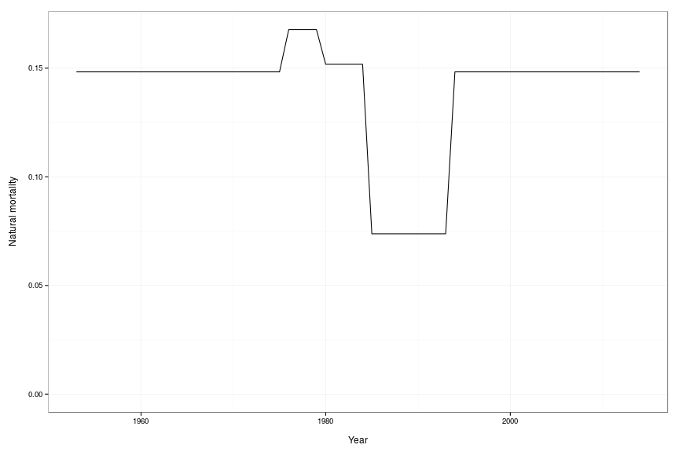 

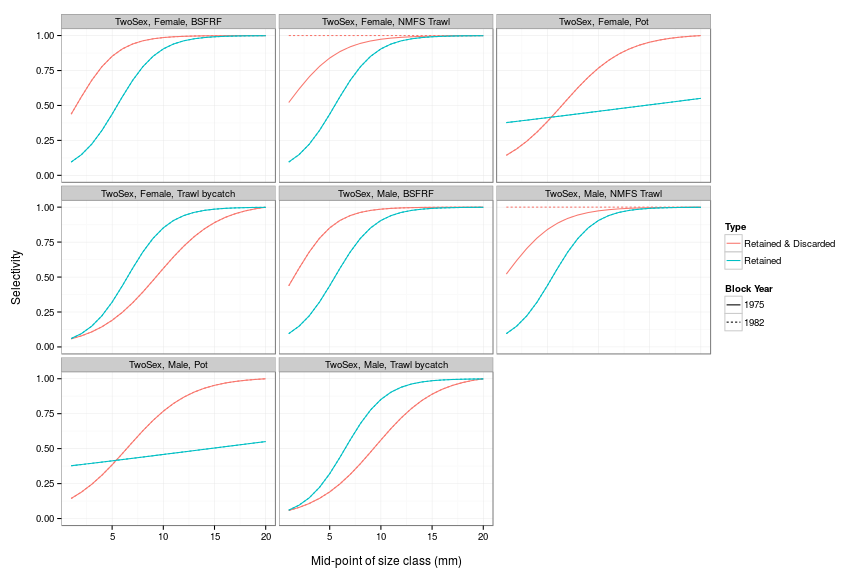 

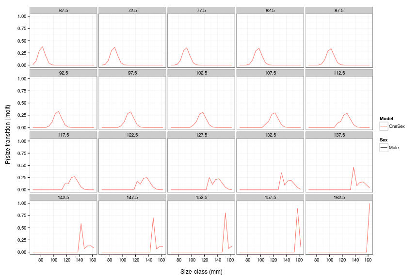 

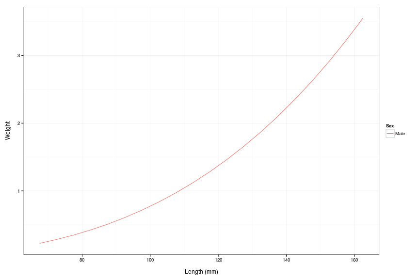 

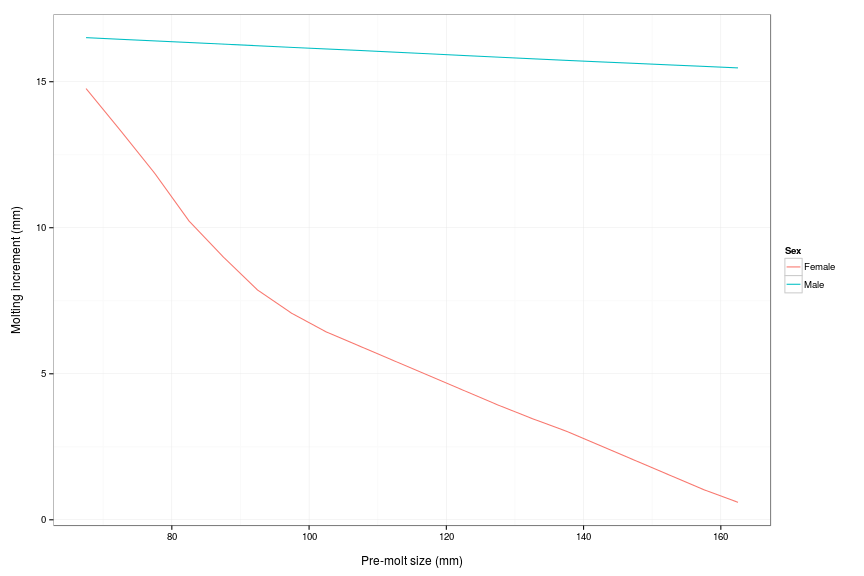 

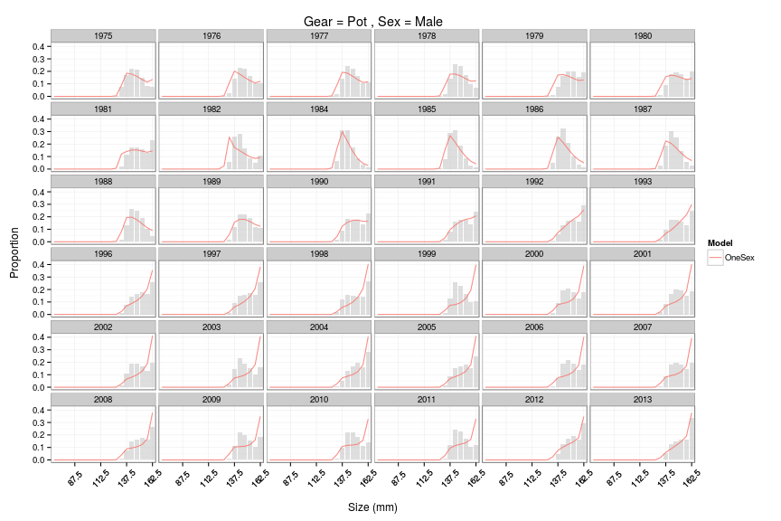 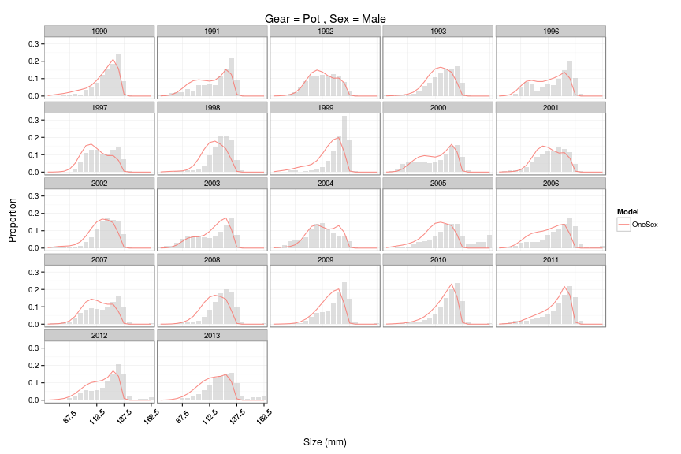 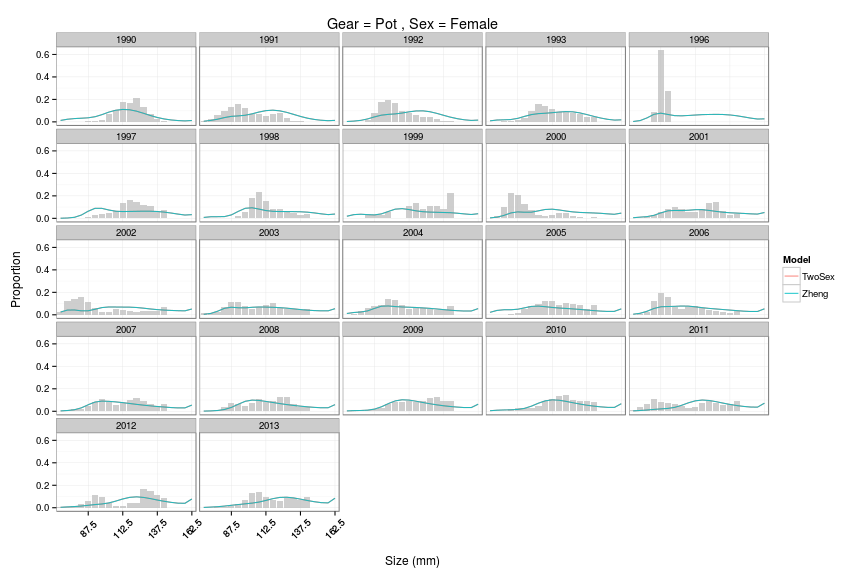 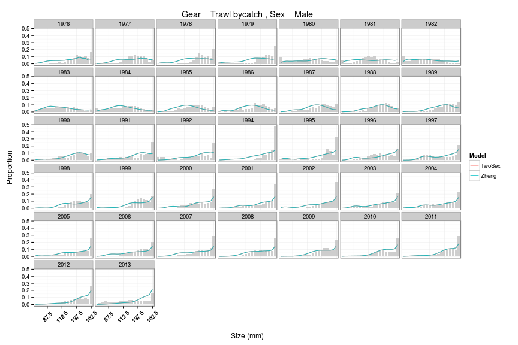 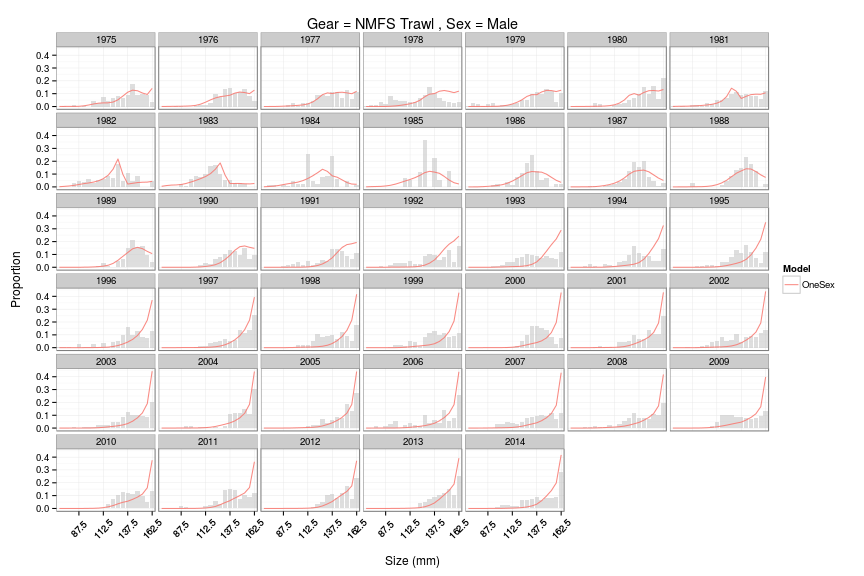  

## Comparison of Assessment Processes

### File Description

  * The `*.tpl` file is working, it builds and the `*.exe` file runs successfully.
  * The main `*.dat` file is read in as expected (comments within).
  * There is a second data file `rksize13s.dat` with sample sizes for 
    various rows of size-comp data. See lines 81-87 of `*.tpl`. 
  * Input sample sizes appear to be capped to the constant numbers entered in 
    the main data file under 'number of samples' or 'sample sizes' (variously).
  * There is a third data file `tc7513s.dat` specifically for data from the
    tanner crab fishery (with red crab bycatch).
  * There is a standard control file `*.ctl` with internal comments.
  * There is an excel spreadsheet which can be used to read in the model
    output files and display related plots (it's a bit clunky).

  * There are two batch files in the model directory: `clean.bat` and `scratch.bat`.
    The 'clean' batch file deletes files related to a single model run. The
    'scratch' batch file deletes all files relating to the model build and 
    leaves only source and data files.

## Discussion

This discussion will focus on the challenges in developing a Gmacs version of
the BBRKC model: those met, and those yet to be met.

## References
