# Executive Summary

1. **Stock**: Red king crab (RKC), *Paralithodes camtschaticus*, in Bristol Bay, Alaska.

2. **Catch**: 
The domestic RKC fishery began to expand in the late 1960s and peaked in 1980
with a catch of 129.95 million lbs (58,943 t). The catch declined in the early
1980s and remained at low levels during the last three decades. The retained catch in 2015/16
was about 10 million lbs (4,500 t), similar to the catch in 2014/15. The magnitude of
bycatch from groundfish trawl fisheries has been stable and small relative to stock
abundance during the last 10 years.

3. **Stock biomass**: 
Estimated mature biomass increased dramatically in the mid 1970s and
decreased precipitously in the early 1980s. Estimated mature crab abundance had increased
during 1985-2009 with mature females being about three times more abundant in 2009 than
in 1985 and mature males being about two times more abundant in 2009 than in 1985.
Estimated mature abundance has steadily declined since 2009.

4. **Recruitment**: 
Estimated recruitment was high during the 1970s and early 1980s and has
generally been low since 1985. During 1984-2016, in only 6 years 
were estimated recruitments above the historical average for
1976-2016. Estimated recruitment was low during the last 10 years.

5. **Management performance**:  Status and catch specifications (1,000 t)
(scenario 2) are given below. Total male catch has been estimated as the sum
of fishery-reported  retained catch, estimated male discard mortality in the
directed fishery, and estimated male bycatch  mortality in the Tanner crab and
groundfish fisheries.  The stock was above the minimum stock-size threshold
(MSST) in 2016/17 and is  hence not overfished. Overfishing did not occur in
2016/17 (Tables \ref{tab:status} and \ref{tab:status_pounds}).
  
\begin{table}[ht]
\centering
\caption{Status and catch specifications (1000 tons) (scenario {\bf Gmacs base}).}
\label{tab:status}
\begin{tabular}{lccccccc}
\hline
          &          & Biomass                        &     & Retained & Total &     & \\ 
Year      & MSST     & ($\mathit{MMB}_\text{mating}$) & TAC & catch    & catch & OFL & ABC \\ 
\hline
2012/13   & 13.19$^A$   & 29.05$^A$   & 3.56 & 3.62 & 3.9  & 7.96 & 7.17 \\
2013/14   & 12.85$^B$   & 27.12$^B$   & 3.90 & 3.99 & 4.56 & 7.07 & 6.36 \\
2014/15   & 13.03$^C$   & 27.25$^C$   & 4.49 & 4.54 & 5.44 & 6.82 & 6.14 \\
2015/16   & 12.89$^D$   & 27.68$^D$   & 4.52 & 4.61 & 5.34 & 6.73 & 6.06 \\
2016/17   &             & 24.00$^D$   &      &      &      & 6.64 & 5.97 \\
\hline
\end{tabular}
\end{table}

\begin{table}[ht]
\centering
\caption{Status and catch specifications (million pounds) (scenario {\bf Gmacs base}).} 
\label{tab:status_pounds}
\begin{tabular}{lcccccccc}
\hline
          &          & Biomass                        &     & Retained & Total &     &     \\ 
Year      & MSST     & ($\mathit{MMB}_\text{mating}$) & TAC & catch    & catch & OFL & ABC \\ 
\hline
2012/13 & 29.1$^A$ & 64.0$^A$         & 7.85 & 7.98           & 8.59        & 17.55 & 15.8  \\
2013/14 & 28.3$^B$ & 59.9$^B$         & 8.6  & 8.8            & 10.05       & 15.58 & 14.02 \\
2014/15 & 28.7$^C$ & 60.1$^C$         & 9.99 & 10.01          & 11.99       & 15.04 & 13.53 \\
2015/16 & 28.4$^D$ & 61.0$^D$         & 9.97 & 10.17          & 11.77       & 14.84 & 13.36 \\
2016/17 &          & 52.9$^D$         &      &                &             & 14.63 & 13.17 \\
\hline
\end{tabular} \\
     
\begin{flushleft}
\footnotesize
Notes: \\
A – Calculated from the assessment reviewed by the Crab Plan Team in September 2013 \\
B – Calculated from the assessment reviewed by the Crab Plan Team in September 2014 \\
C – Calculated from the assessment reviewed by the Crab Plan Team in September 2015\\
D – Calculated from the assessment reviewed by the Crab Plan Team in September 2016\\
\end{flushleft}
\end{table}

6. **Basis for the OFL**: Estimated mature-male biomass (MMB) on 15 February is used as the measure of biomass for this Tier 4 stock, with males measuring 105 mm CL or more considered mature. The $B_\mathit{MSY}$ proxy is obtained by averaging estimated MMB over a specific reference time period, and current CPT/SSC guidance recommends using the full assessment time frame as the default reference period (Table \ref{tab:ofl_basis}).
\begin{table}[ht]
\centering
\caption{Basis for the OFL (1000 tons) (scenario {\bf Gmacs base}).} 
\label{tab:ofl_basis}
\begin{tabular}{lcccccccc}
\hline
     &      &                  & Biomass                        &                    &                  &          &                            & Natural  \\ 
Year & Tier & $B_\mathit{MSY}$ & ($\mathit{MMB}_\text{mating}$) & $B/B_\mathit{MSY}$ & $F_\mathit{OFL}$ & $\gamma$ & Basis for $B_\mathit{MSY}$ & mortality \\ 
\hline
2012/13 & 3b & 27.5 & 26.3    & 0.96         & 0.31 & 1.0 & 1984-2012 &          0.18 \\
2013/14 & 3b & 26.4 & 25.0    & 0.95         & 0.27 & 1.0 & 1984-2013 &          0.18 \\
2014/15 & 3b & 25.7 & 24.7    & 0.96         & 0.28 & 1.0 & 1984-2014 &          0.18 \\
2015/16 & 3b & 26.1 & 24.7    & 0.95         & 0.27 & 1.0 & 1984-2015 &          0.18 \\
2016/17 & 3b & 25.8 & 24.0    & 0.93         & 0.27 & 1.0 & 1984-2016 &          0.18 \\
\hline
\end{tabular}
\end{table}

\begin{table}[ht]
\centering
\caption{Basis for the OFL (millions of lbs ) (scenario {\bf Gmacs base}).} 
\label{tab:ofl_basis_pounds}
\begin{tabular}{lcccccccc}
\hline
     &      &                  & Biomass                        &                    &                  &          &                            & Natural  \\ 
Year & Tier & $B_\mathit{MSY}$ & ($\mathit{MMB}_\text{mating}$) & $B/B_\mathit{MSY}$ & $F_\mathit{OFL}$ & $\gamma$ & Basis for $B_\mathit{MSY}$ & mortality \\ 
\hline
2012/13 & 3b & 60.7 & 58.0   & 0.96         & 0.31 & 1.0 & 1984-2012 &            0.18 \\
2013/14 & 3b & 58.2 & 55.0   & 0.95         & 0.27 & 1.0 & 1984-2013 &            0.18 \\
2014/15 & 3b & 56.7 & 54.4   & 0.96         & 0.28 & 1.0 & 1984-2014 &            0.18 \\
2015/16 & 3b & 57.5 & 54.4   & 0.95         & 0.27 & 1.0 & 1984-2015 &            0.18 \\
2016/17 & 3b & 56.8 & 52.9   & 0.93         & 0.27 & 1.0 & 1984-2016 &            0.18 \\
\hline
\end{tabular}
\end{table}

# A. Summary of Major Changes

## Changes in Management of the Fishery

There were no new changes in management of the fishery.

## Changes to the Input Data
  a. The new 2016 NMFS trawl survey data and BSFRF side-by-side trawl survey data
   during 2013-2016 were used.
  b. Catch and biomass data were updated to include the 2016/17 information.
  c. The Tanner crab fishery was split out from the directed fishery bycatch data.
  d. The groundfish "fixed-gear" fishery was split from the trawl-gear bycatch data.

## Changes in Assessment Methodology
This assessment was done using Gmacs. 
There are several differences between the
Gmacs assessment model and the previous model. One of the major differences
being that natural and fishing mortality are continuous within 
4 discrete seasons. Season length in Gmacs is controlled by
changing the proportion of natural mortality that is applied during each
season. A detailed outline of the Gmacs implementation of the BBRKC model is
provided in Appendix A.

## Changes in Assessment Results
Results from the alternative models are qualitatively very similar to those conducted using 
the current assessment approach.
  
# B. Responses to SSC and CPT Comments

## CPT and SSC Comments on Assessments in General

Comment: 

Response: 

## CPT and SSC Comments Specific to the BBRKC Stock Assessment

Comment: 
*The SSC and CPT (loosely) requested the following models for review at the spring 2017 meeting:*

  1. *Base: try to match 2016 model *
  2. *Free q*
  3. *Evaluate M*

Response:  

Models 1, 2, and 3 are all included and evaluated in
this document as the **Gmacs base** (the same type of blocked changes in time for natural mortality), **Free q** (estimate the catchability of BSFRF survey), and **Variable M** (look at a flexible time-varying natural mortality configuration)
scenarios. 
\newpage\clearpage

# C. Introduction

## Scientific Name
Red king crab (RKC), *Paralithodes camtschaticus*, in Bristol Bay, Alaska.

## Distribution
Red king crab inhabit intertidal waters to depths >200 m of the North Pacific Ocean from British
Columbia, Canada, to the Bering Sea, and south to Hokkaido, Japan, and are found in several
areas of the Aleutian Islands, eastern Bering Sea, and the Gulf of Alaska.

## Stock Structure
The State of Alaska divides the Aleutian Islands and eastern Bering Sea into three management
registration areas to manage RKC fisheries: Aleutian Islands, Bristol Bay, and Bering Sea
(Alaska Department of Fish and Game (ADF&G) 2012). The Bristol Bay area includes all waters
north of the latitude of Cape Sarichef (54°36' N lat.), east of 168°00' W long., and south of the
latitude of Cape Newenham (58°39' N lat.) and the fishery for RKC in this area is managed
separately from fisheries for RKC outside of this area; i.e., the red king crab in the Bristol Bay
area are assumed to be a separate stock from red king crab outside of this area. This report
summarizes the stock assessment results for the Bristol Bay RKC stock.

## Life History
Red king crab have a complex life history. Fecundity is a function of female size, ranging from
several tens of thousands to a few hundreds of thousands (Haynes 1968; Swiney et al. 2012). The
eggs are extruded by females, fertilized in the spring, and held by females for about 11 months
(Powell and Nickerson 1965). Fertilized eggs are hatched in the spring, most during April-June
(Weber 1967). Primiparous females are bred a few weeks earlier in the season than multiparous
females.
Larval duration and juvenile crab growth depend on temperature (Stevens 1990; Stevens and
Swiney 2007). Male and female RKC mature at 5–12 years old, depending on stock and
temperature (Loher et al. 2001; Stevens 1990) and may live >20 years (Matsuura and Takeshita
1990). Males and females attain a maximum size of 227 and 195 mm carapace length (CL),
respectively (Powell and Nickerson 1965). Female maturity is evaluated by the size at which
females are observed to carry egg clutches. Male maturity can be defined by multiple criteria
including spermataphore production and size, chelae vs. carapace allometry, and participation in
mating in situ (reviewed by Webb 2014). For management purposes, females >89 mm CL and
males >119 mm CL are assumed to be mature for Bristol Bay RKC. Juvenile RKC molt multiple
times per year until age 3 or 4; thereafter, molting continues annually in females for life and in
males until maturity. Male molting frequency declines after attaining functional maturity.

## Fishery
The RKC stock in Bristol Bay, Alaska, supports one of the most valuable fisheries in the United
States. A review of the history of the Bristol Bay RKC fishery is provided in Fitch et al. (2012) and
Otto (1989). The Japanese fleet started the fishery in the early 1930s, stopped fishing from 1940 to
1952, and resumed the fishery from 1953 until 1974. The Russian fleet fished for RKC from 1959
to 1971. The Japanese fleet employed primarily tanglenets with a very small proportion of catch
from trawls and pots. The Russian fleet used only tanglenets. United States trawlers started fishing
Bristol Bay RKC in 1947, but the effort and catch declined in the 1950s. The domestic RKC fishery
began to expand in the late 1960s and peaked in 1980 with a catch of 129.95 million lbs (58,943 t),
worth an estimated $115.3 million ex-vessel value. The catch declined dramatically in the early
1980s and has remained at low levels during the last two decades (Table 1). After the early 1980s
stock collapse, the Bristol Bay RKC fishery took place during a short period in the fall (usually
lasting about a week) with the catch quota based on the stock assessment conducted the previous
summer (Zheng and Kruse 2002). Beginning with the 2005/2006 season, new regulations associated
with fishery rationalization resulted in an increase in the duration of the fishing season (October 15
to January 15). With the implementation of crab rationalization, historical guideline harvest levels
(GHL) were changed to a total allowable catch (TAC). Before rationalization, the implementation
errors were quite high for some years and total actual catch from 1980 to 2007 was about 6\% less
than the sum of GHL/TAC over that period.

## Fisheries Management
King and Tanner crab stocks in the Bering Sea and Aleutian Islands are managed by the State of
Alaska through a Federal king and Tanner crab fishery management plan (FMP). Under the FMP,
management measures are divided into three categories: (1) fixed in the FMP, (2) frame worked in
the FMP, and (3) discretion of the State of Alaska. The State of Alaska is responsible for
determining and establishing the GHL/TAC under the framework in the FMP.
Harvest strategies for the Bristol Bay RKC fishery have changed over time. Two major
management objectives for the fishery are to maintain a healthy stock that ensures reproductive
viability and to provide for sustained levels of harvest over the long term (ADF&G 2012). In
attempting to meet these objectives, the GHL/TAC is coupled with size-sex-season restrictions.
Only males ≥6.5-in carapace width (equivalent to 135-mm carapace length, CL) may be
harvested and no fishing is allowed during molting and mating periods (ADF&G 2012).
Specification of TAC is based on a harvest rate strategy. Before 1990, harvest rates on legal
males were based on population size, abundance of prerecruits to the fishery, and postrecruit
abundance, and rates varied from less than 20\% to 60\% (Schmidt and Pengilly 1990). In 1990,
the harvest strategy was modified, and a 20\% mature male harvest rate was applied to the
abundance of mature-sized (≥120-mm CL) males with a maximum 60\% harvest rate cap of legal
(≥135-mm CL) males (Pengilly and Schmidt 1995). In addition, a minimum threshold of 8.4
million mature-sized females (≥90-mm CL) was added to existing management measures to
avoid recruitment overfishing (Pengilly and Schmidt 1995). Based on a new assessment model
and research findings (Zheng et al. 1995a, 1995b, 1997a, 1997b), the Alaska Board of Fisheries
adopted a new harvest strategy in 1996. That strategy had two mature male harvest rates: 10\%
when effective spawning biomass (ESB) is between 14.5 and 55.0 million lbs and 15\% when
ESB is at or above 55.0 million lbs (Zheng et al. 1996). The maximum harvest rate cap of legal
males was changed from 60\% to 50\%. A threshold of 14.5 million lbs of ESB was also added. In
1997, a minimum threshold of 4.0 million lbs was established as the minimum GHL for opening
the fishery and maintaining fishery manageability when the stock abundance is low. The Board
modified the current harvest strategy by adding a mature harvest rate of 12.5\% when the ESB is
between 34.75 and 55.0 million lbs in 2003 and eliminated the minimum GHL threshold in 2012.
The current harvest strategy is illustrated in Figure 1.

 

\begin{table}[ht]
\centering
\caption{Bristol Bay red king crab annual catch and bycatch mortality biomass (t) from
June 1 to May 31. A handling mortality rate of 20\% for the directed pot, 25\%
for the Tanner fishery, and 80\% for trawl was assumed to estimate bycatch
mortality biomass.}
\label{tab:bbrkc_fishery}
\footnotesize
\begin{tabular}{@{\extracolsep{4pt}}lrrrrrrrrr@{}}
\hline
Year & \multicolumn{4}{c}{Retained Catch}                 & \multicolumn{2}{c}{Pot Bycatch} & Trawl         & Tanner Fishery  & Total      \\
\cline{2-5}\cline{6-7}
     & U.S.           & Cost-Recovery & Foreign & Total   & Males       & Females & Bycatch       & Bycatch        & Catch      \\
\hline
1953 & 1331.3         &               & 4705.6  & 6036.9  &             &         &               &                & 6036.9     \\
1954 & 1149.9         &               & 3720.4  & 4870.2  &             &         &               &                & 4870.2      \\
1955 & 1029.2         &               & 3712.7  & 4741.9  &             &         &               &                & 4741.9      \\
1956 & 973.4          &               & 3572.9  & 4546.4  &             &         &               &                & 4546.4      \\
1957 & 339.7          &               & 3718.1  & 4057.8  &             &         &               &                & 4057.8      \\
1958 & 3.2            &               & 3541.6  & 3544.8  &             &         &               &                & 3544.8      \\
1959 & 0              &               & 6062.3  & 6062.3  &             &         &               &                & 6062.3      \\
1960 & 272.2          &               & 12200.7 & 12472.9 &             &         &               &                & 12472.9     \\
1961 & 193.7          &               & 20226.6 & 20420.3 &             &         &               &                & 20420.3     \\
1962 & 30.8           &               & 24618.7 & 24649.6 &             &         &               &                & 24649.6     \\
1963 & 296.2          &               & 24930.8 & 25227   &             &         &               &                & 25227       \\
1964 & 373.3          &               & 26385.5 & 26758.8 &             &         &               &                & 26758.8     \\
1965 & 648.2          &               & 18730.6 & 19378.8 &             &         &               &                & 19378.8     \\
1966 & 452.2          &               & 19212.4 & 19664.6 &             &         &               &                & 19664.6     \\
1967 & 1407           &               & 15257   & 16664.1 &             &         &               &                & 16664.1     \\
1968 & 3939.9         &               & 12459.7 & 16399.6 &             &         &               &                & 16399.6     \\
1969 & 4718.7         &               & 6524    & 11242.7 &             &         &               &                & 11242.7     \\
1970 & 3882.3         &               & 5889.4  & 9771.7  &             &         &               &                & 9771.7      \\
1971 & 5872.2         &               & 2782.3  & 8654.5  &             &         &               &                & 8654.5      \\
1972 & 9863.4         &               & 2141    & 12004.3 &             &         &               &                & 12004.3     \\
1973 & 12207.8        &               & 103.4   & 12311.2 &             &         &               &                & 12311.2     \\
1974 & 19171.7        &               & 215.9   & 19387.6 &             &         &               &                & 19387.6     \\
1975 & 23281.2        &               & 0       & 23281.2 &             &         &               &                & 23281.2     \\
1976 & 28993.6        &               & 0       & 28993.6 &             &         & 682.8         &                & 29676.4     \\
1977 & 31736.9        &               & 0       & 31736.9 &             &         & 1249.9        &                & 32986.8     \\
1978 & 39743          &               & 0       & 39743   &             &         & 1320.6        &                & 41063.6     \\
1979 & 48910          &               & 0       & 48910   &             &         & 1331.9        &                & 50241.9     \\
1980 & 58943.6        &               & 0       & 58943.6 &             &         & 1036.5        &                & 59980.1     \\
1981 & 15236.8        &               & 0       & 15236.8 &             &         & 219.4         &                & 15456.2     \\
1982 & 1361.3         &               & 0       & 1361.3  &             &         & 574.9         &                & 1936.2      \\
1983 & 0              &               & 0       & 0       &             &         & 420.4         &                & 420.4       \\
1984 & 1897.1         &               & 0       & 1897.1  &             &         & 1094          &                & 2991.1      \\
1985 & 1893.8         &               & 0       & 1893.8  &             &         & 390.1         &                & 2283.8      \\
1986 & 5168.2         &               & 0       & 5168.2  &             &         & 200.6         &                & 5368.8      \\
1987 & 5574.2         &               & 0       & 5574.2  &             &         & 186.4         &                & 5760.7      \\
1988 & 3351.1         &               & 0       & 3351.1  &             &         & 597.8         &                & 3948.9      \\
1989 & 4656           &               & 0       & 4656    &             &         & 174.1         &                & 4830.1      \\
1990 & 9236.2         & 36.6          & 0       & 9272.8  & 526.9       & 651.5   & 247.6         &                & 10698.7     \\
1991 & 7791.8         & 93.4          & 0       & 7885.1  & 407.8       & 75      & 316           & 1401.8         & 10085.7     \\
1992 & 3648.2         & 33.6          & 0       & 3681.8  & 552         & 418.5   & 335.4         & 244.4          & 5232.2      \\
1993 & 6635.4         & 24.1          & 0       & 6659.6  & 763.2       & 637.1   & 426.6         & 54.6           & 8541        \\
1994 & 0              & 42.3          & 0       & 42.3    & 3.8         & 1.9     & 88.9          & 10.8           & 147.8       \\
1995 & 0              & 36.4          & 0       & 36.4    & 3.3         & 1.6     & 194.2         & 0              & 235.5       \\
1996 & 3812.7         & 49            & 0       & 3861.7  & 164.6       & 1       & 106.5         & 0              & 4133.9      \\
1997 & 3971.9         & 70.2          & 0       & 4042.1  & 244.7       & 19.6    & 73.4          & 0              & 4379.8      \\
1998 & 6693.8         & 85.4          & 0       & 6779.2  & 959.7       & 864.9   & 159.8         & 0              & 8763.7      \\
1999 & 5293.5         & 84.3          & 0       & 5377.9  & 314.2       & 8.8     & 201.6         & 0              & 5902.4      \\
2000 & 3698.8         & 39.1          & 0       & 3737.9  & 360.8       & 40.5    & 100.4         & 0              & 4239.5      \\
2001 & 3811.5         & 54.6          & 0       & 3866.2  & 417.9       & 173.5   & 164.6         & 0              & 4622.1      \\
2002 & 4340.9         & 43.6          & 0       & 4384.5  & 442.7       & 7.3     & 155.1         & 0              & 4989.6      \\
2003 & 7120           & 15.3          & 0       & 7135.3  & 918.9       & 430.4   & 172.3         & 0              & 8656.9      \\
2004 & 6915.2         & 91.4          & 0       & 7006.7  & 345.5       & 187     & 119.6         & 0              & 7658.8      \\
2005 & 8305           & 94.7          & 0       & 8399.7  & 1359.5      & 498.3   & 155.2         & 0              & 10412.8     \\
2006 & 7005.3         & 137.9         & 0       & 7143.2  & 563.8       & 37      & 116.7         & 3.8            & 7864.4      \\
2007 & 9237.9         & 66.1          & 0       & 9303.9  & 1001.3      & 186.1   & 138.5         & 1.8            & 10631.6     \\
2008 & 9216.1         & 0             & 0       & 9216.1  & 1165.5      & 148.4   & 159.5         & 4              & 10693.5     \\
2009 & 7226.9         & 45.5          & 0       & 7272.5  & 888.1       & 85.2    & 103.7         & 1.6            & 8351.2      \\
2010 & 6728.5         & 33            & 0       & 6761.5  & 797.5       & 122.6   & 85.3          & 0              & 7767        \\
2011 & 3553.3         & 53.8          & 0       & 3607.1  & 395         & 24      & 68.8          & 0              & 4094.9      \\
2012 & 3560.6         & 61.1          & 0       & 3621.7  & 205.2       & 12.3    & 61.2          & 0              & 3900.5      \\
2013 & 3901.1         & 89.9          & 0       & 3991    & 310.6       & 99.8    & 136.2         & 28.5           & 4566        \\
2014 & 4530           & 8.6           & 0       & 4538.6  & 584.7       & 86.2    & 221.9         & 42             & 5473.4      \\
2015 & 4522.3         & 91.4          & 0       & 4613.7  & 266.1       & 222.9   & 149.4         & 84.2           & 5336.3      \\
\hline
\end{tabular}
\end{table}

\begin{table}[ht]
\centering
\caption{Annual retained catch (millions of crab) and catch per unit effort of the Bristol Bay red king crab fishery.}
\label{tab:bbrkc_catch_cpue}
\footnotesize
\begin{tabular}{@{\extracolsep{4pt}}lrrrrrrr@{}}
\hline
Year & \multicolumn{2}{c}{Japanese Tanglenet} & \multicolumn{2}{c}{Russian Tanglenet} & \multicolumn{2}{c}{U.S. Pot/Trawl}  & Standardized \\
\cline{2-3}\cline{4-5}\cline{6-7}
     & Catch & Crab/tan                       & Catch & Crab/tan                      & Catch & Crab/Potlift                & Crab/tan \\
\hline
1960 & 1.949 & 15.2                           & 1.995 & 10.4                          & 0.088  &                             & 15.8 \\
1961 & 3.031 & 11.8                           & 3.441 & 8.9                           & 0.062  &                             & 12.9 \\
1962 & 4.951 & 11.3                           & 3.019 & 7.2                           & 0.010  &                             & 11.3 \\
1963 & 5.476 & 8.5                            & 3.019 & 5.6                           & 0.101  &                             & 8.6  \\
1964 & 5.895 & 9.2                            & 2.800 & 4.6                           & 0.123  &                             & 8.5  \\
1965 & 4.216 & 9.3                            & 2.226 & 3.6                           & 0.223  &                             & 7.7  \\
1966 & 4.206 & 9.4                            & 2.560 & 4.1                           & 0.140  & 52                          & 8.1  \\
1967 & 3.764 & 8.3                            & 1.592 & 2.4                           & 0.397  & 37                          & 6.3  \\
1968 & 3.853 & 7.5                            & 0.549 & 2.3                           & 1.278  & 27                          & 7.8  \\
1969 & 2.073 & 7.2                            & 0.369 & 1.5                           & 1.749  & 18                          & 5.6  \\
1970 & 2.080 & 7.3                            & 0.320 & 1.4                           & 1.683  & 17                          & 5.6  \\
1971 & 0.886 & 6.7                            & 0.265 & 1.3                           & 2.405  & 20                          & 5.8  \\
1972 & 0.874 & 6.7                            &       &                               & 2.405  & 20                          &      \\
1973 & 0.228 &                                &       &                               & 4.826  & 25                          &      \\
1974 & 0.476 &                                &       &                               & 7.710  & 36                          &      \\
1975 &       &                                &       &                               & 8.745  & 43                          &      \\
1976 &       &                                &       &                               & 10.603 & 33                          &      \\
1977 &       &                                &       &                               & 11.733 & 26                          &      \\
1978 &       &                                &       &                               & 14.746 & 36                          &      \\
1979 &       &                                &       &                               & 16.809 & 53                          &      \\
1980 &       &                                &       &                               & 20.845 & 37                          &      \\
1981 &       &                                &       &                               & 5.308  & 10                          &      \\
1982 &       &                                &       &                               & 0.541  & 4                           &      \\
1983 &       &                                &       &                               & 0.000  &                             &      \\
1984 &       &                                &       &                               & 0.794  & 7                           &      \\
1985 &       &                                &       &                               & 0.796  & 9                           &      \\
1986 &       &                                &       &                               & 2.100  & 12                          &      \\
1987 &       &                                &       &                               & 2.122  & 10                          &      \\
1988 &       &                                &       &                               & 1.236  & 8                           &      \\
1989 &       &                                &       &                               & 1.685  & 8                           &      \\
1990 &       &                                &       &                               & 3.130  & 12                          &      \\
1991 &       &                                &       &                               & 2.661  & 12                          &      \\
1992 &       &                                &       &                               & 1.208  & 6                           &      \\
1993 &       &                                &       &                               & 2.270  & 9                           &      \\
1994 &       &                                &       &                               & 0.015  &                             &      \\
1995 &       &                                &       &                               & 0.014  &                             &      \\
1996 &       &                                &       &                               & 1.264  & 16                          &      \\
1997 &       &                                &       &                               & 1.338  & 15                          &      \\
1998 &       &                                &       &                               & 2.238  & 15                          &      \\
1999 &       &                                &       &                               & 1.923  & 12                          &      \\
2000 &       &                                &       &                               & 1.272  & 12                          &      \\
2001 &       &                                &       &                               & 1.287  & 19                          &      \\
2002 &       &                                &       &                               & 1.484  & 20                          &      \\
2003 &       &                                &       &                               & 2.510  & 18                          &      \\
2004 &       &                                &       &                               & 2.272  & 23                          &      \\
2005 &       &                                &       &                               & 2.763  & 30                          &      \\
2006 &       &                                &       &                               & 2.477  & 31                          &      \\
2007 &       &                                &       &                               & 3.154  & 28                          &      \\
2008 &       &                                &       &                               & 3.064  & 22                          &      \\
2009 &       &                                &       &                               & 2.553  & 21                          &      \\
2010 &       &                                &       &                               & 2.410  & 18                          &      \\
2011 &       &                                &       &                               & 1.298  & 28                          &      \\
2012 &       &                                &       &                               & 1.176  & 30                          &      \\
2013 &       &                                &       &                               & 1.272  & 27                          &      \\
2014 &       &                                &       &                               & 1.501  & 26                          &      \\
2015 &       &                                &       &                               & 1.527  & 31                          &      \\
\hline
\end{tabular}
\end{table}

\begin{table}[ht]
\centering
\caption{Annual sample sizes (>64 mm CL) in numbers of crab for trawl surveys, retained
catch and pot and trawl fishery bycatch of Bristol Bay red king crab.}
\label{tab:sample_size}
\begin{tabular}{@{\extracolsep{4pt}}lrrrrrrrrr@{}}
  \hline
  & \multicolumn{2}{c}{Trawl survey}      & Retained  & \multicolumn{2}{c}{Pot bycatch}     & \multicolumn{2}{c}{Trawl bycatch}     & \multicolumn{2}{c}{Tanner bycatch}      \\
\cline{2-3}\cline{5-6}\cline{7-8}\cline{9-10}
Year  & Males & Females & Catch & Males & Females & Males & Females & Males & Females \\
\hline
1975  & 2,943 & 2,139 & 29,570  &   &   &   &   &   &   \\
1976  & 4,724 & 2,956 & 26,450  &   &   & 2,327 & 676 &   &   \\
1977  & 3,636 & 4,178 & 32,596  &   &   & 14,014  & 689 &   &   \\
1978  & 4,132 & 3,948 & 27,529  &   &   & 8,983 & 1,456 &   &   \\
1979  & 5,807 & 4,663 & 27,900  &   &   & 7,228 & 2,821 &   &   \\
1980  & 2,412 & 1,387 & 34,747  &   &   & 47,463  & 39,689  &   &   \\
1981  & 3,478 & 4,097 & 18,029  &   &   & 42,172  & 49,634  &   &   \\
1982  & 2,063 & 2,051 & 11,466  &   &   & 84,240  & 47,229  &   &   \\
1983  & 1,524 & 944 & 0 &   &   & 204,464 & 104,910 &   &   \\
1984  & 2,679 & 1,942 & 4,404 &   &   & 357,981 & 147,134 &   &   \\
1985  & 792 & 415 & 4,582 &   &   & 169,767 & 30,693  &   &   \\
1986  & 1,962 & 367 & 5,773 &   &   & 1,199 & 284 &   &   \\
1987  & 1,168 & 1,018 & 4,230 &   &   & 723 & 927 &   &   \\
1988  & 1,834 & 546 & 9,833 &   &   & 437 & 275 &   &   \\
1989  & 1,257 & 550 & 32,858  &   &   & 3,147 & 194 &   &   \\
1990  & 858 & 603 & 7,218 & 873 & 699 & 761 & 1,570 &   &   \\
1991  & 1,378 & 491 & 36,820  & 1,801 & 375 & 208 & 396 & 885 & 2,198 \\
1992  & 513 & 360 & 23,552  & 3,248 & 2,389 & 214 & 107 & 280 & 685 \\
1993  & 1,009 & 534 & 32,777  & 5,803 & 5,942 &   &   & 232 & 265 \\
1994  & 443 & 266 & 0 & 0 & 0 & 330 & 247 &   &   \\
1995  & 2,154 & 1,718 & 0 & 0 & 0 & 103 & 35  &   &   \\
1996  & 835 & 816 & 8,896 & 230 & 11  & 1,025 & 968 &   &   \\
1997  & 1,282 & 707 & 15,747  & 4,102 & 906 & 1,202 & 483 &   &   \\
1998  & 1,097 & 1,150 & 16,131  & 11,079  & 9,130 & 1,627 & 915 &   &   \\
1999  & 764 & 540 & 17,666  & 1,048 & 36  & 2,154 & 858 &   &   \\
2000  & 731 & 1,225 & 14,091  & 8,970 & 1,486 & 994 & 671 &   &   \\
2001  & 611 & 743 & 12,854  & 9,102 & 4,567 & 4,393 & 2,521 &   &   \\
2002  & 1,032 & 896 & 15,932  & 9,943 & 302 & 3,372 & 1,464 &   &   \\
2003  & 1,669 & 1,311 & 16,212  & 17,998  & 10,327  & 1,568 & 1,057 &   &   \\
2004  & 2,871 & 1,599 & 20,038  & 8,258 & 4,112 & 1,689 & 1,506 &   &   \\
2005  & 1,283 & 1,682 & 21,938  & 55,019  & 26,775  & 1,815 & 1,872 &   &   \\
2006  & 1,171 & 2,672 & 18,027  & 32,252  & 3,980 & 1,481 & 1,983 &   &   \\
2007  & 1,219 & 2,499 & 22,387  & 59,769  & 12,661  & 1,011 & 1,097 &   &   \\
2008  & 1,221 & 3,352 & 14,567  & 49,315  & 8,488 & 1,867 & 1,039 &   &   \\
2009  & 830 & 1,857 & 16,708  & 52,359  & 6,041 & 1,482 & 870 &   &   \\
2010  & 705 & 1,633 & 20,137  & 36,654  & 6,868 & 734 & 846 &   &   \\
2011  & 525 & 994 & 10,706  & 20,629  & 1,920 & 600 & 1,069 &   &   \\
2012  & 580 & 707 & 8,956 & 7,206 & 561 & 1,577 & 1,752 &   &   \\
2013  & 633 & 560 & 10,197  & 13,828  & 6,048 & 4,681 & 4,198 & 218 & 596 \\
2014  & 1,106 & 1,255 & 9,618 & 13,040  & 1,950 & 1,966 & 2,580 & 256 & 381 \\
2015  & 600 & 677 & 11,746  & 8,037 & 5,889 & 1,126 & 3,704 & 726 & 2163  \\
2016  & 374 & 803 &   &   &   &   &   &   &   \\
\hline
\end{tabular}
\end{table}

# D. Data

## Summary of New Information

Data used in this assessment have been updated to include the most recently
available fishery and survey numbers. The NMFS and BSFRF trawl survey data were 
updated to include the survey data in 2016. Catch and biomass data were updated 
to 2016/17. Groundfish fisheries bycatch data during 2009-2016 were updated and 
separated into trawl fisheries and fixed gear. Bycatch of BBRKC in the directed Tanner crab pot fishery were 
also included. Survey and fishery size composition data were also updated and the extent of all different data sources
is shown in Figure \ref{fig:data_extent}.

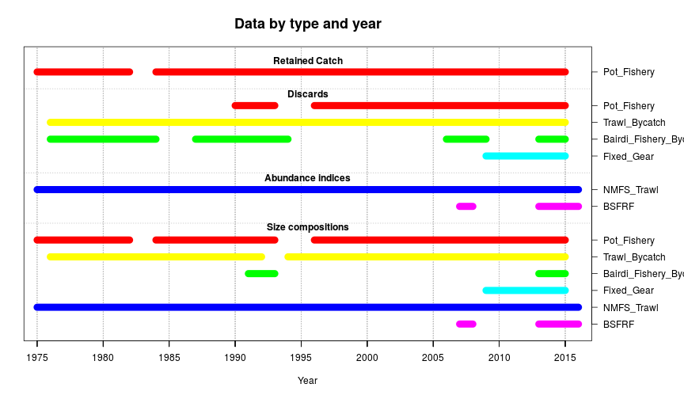

## Major Data Sources

### Fishery 
Data on landings of Bristol Bay RKC by length and year and catch per unit
effort from 1960 to 1973 were obtained from annual reports of the
International North Pacific Fisheries Commission (Hoopes et al. 1972; Jackson
1974; Phinney 1975) and from the ADF&G from 1974 to 2015. Bycatch data are
available starting from 1990 and were obtained from the ADF&G observer
database and reports (Gaeuman 2013). Sample sizes for catch by length and
shell condition are summarized in Table \ref{tab:sample_size}. 
Relatively large samples were taken
from the retained catch each year. Sample sizes for trawl bycatch were the
annual sums of length frequency samples in the National Marine Fisheries
Service (NMFS) database.

#### Catch by fishery
Estimated retained catch and bycatch are summarized in Table
\ref{tab:bbrkc_fishery}).  Catch estimates from the
directed fishery include the general, open-access fishery (prior to
rationalization), or the individual fishery quota (IFQ) fishery (after
rationalization), as well as the Community Development Quota (CDQ) fishery and
the ADF&G cost-recovery harvest. Starting in 1973, the fishery generally
occurred during the late summer and fall. Before 1973, a small portion of
retained catch in some years was caught from April to June. Because most crab
bycatch from the groundfish trawl fisheries occurred during the spring, the
years in Table \ref{tab:bbrkc_fishery} ) are one year less than those from the NMFS trawl bycatch
database to approximate the annual bycatch for reporting years defined as June
1 to May 31; e.g., year 2002 in Table \ref{tab:bbrkc_fishery} for trawl bycatch corresponds to what
is reported for year 2003 in the NMFS database. 
Bycatch data for the cost-recovery fishery before 2006 were 
unavailable. In this report, pot fisheries are distinguished between the directed fishery and
the Tanner crab fishery.

#### Catch size composition
Retained catch by length and shell condition and bycatch by length, shell
condition, and sex were obtained for stock assessments. From 1960 to 1966,
only retained catch length compositions from the Japanese fishery were
available. Retained catch from the Russian and U.S. fisheries were assumed
to have the same length compositions as the Japanese fishery during this
period. From 1967 to 1969, the length compositions from the Russian fishery
were assumed to be the same as those from the Japanese and U.S. fisheries.
After 1969, foreign catch declined sharply and only length compositions from
the U.S. fishery were used to distribute catch by length.

### Surveys
NMFS annual trawl surveys of the eastern Bering Sea began in
1968. Two vessels, each towing an eastern otter trawl with an 83 ft headrope
and a 112 ft footrope, conducted this multispecies, crab-groundfish survey
during the summer. Stations were sampled in the center of a systematic 20 X 20
nm grid overlaid in an area of 140,000 nm^2. Since 1972, the trawl survey has
covered the full stock distribution except in nearshore waters. The survey in
Bristol Bay occurs primarily during late May and June. Tow-by-tow trawl survey
data for Bristol Bay RKC during 1975-2016 were provided by NMFS.

Abundance estimates by sex, carapace length, and shell condition were derived
from survey data using an area-swept approach. 
Until the late 1980s, NMFS used a post-stratification
approach, but subsequently treated Bristol Bay as a single stratum; 
If multiple tows were made for a single station in a given
year, the average of the abundances from all tows within that station was used
as the estimate of abundance for that station. The new time series since 2015
discards all “hot spot” tows.  We used the new area-swept estimates provided
by NMFS in 2016.

In addition to standard surveys, NMFS also conducted some surveys after the
standard surveys to better assess mature female abundance. In addition to the
standard surveys conducted in early June (late May to early June in 1999 and
2000), a portion of the distribution of Bristol Bay RKC was re-surveyed in
1999, 2000, and 2006-2012. "Resurveys" performed in late July, about six weeks
after the standard survey, included 31 stations (1999), 23 stations (2000), 31
stations (2006, 1 bad tow and 30 valid tows), 32 stations (2007-2009), 23
stations (2010) and 20 stations (2011 and 2012) with high female density. The
resurveys were necessary because a high proportion of mature females had not
yet molted or mated when sampled by the standard survey. Differences in area-
swept estimates of abundance between the standard surveys and resurveys of
these same stations are attributed to survey measurement errors or to seasonal
changes in distribution between survey and resurvey. More large females were
observed in the resurveys than during the standard surveys in 1999 and 2000
because most mature females had not molted prior to the standard surveys. As
in 2006, area-swept estimates of males >89 mm CL, mature males, and legal
males within the 32 resurvey stations in 2007 were not significantly different
(P=0.74, 0.74 and 0.95; paired t-test of sample means) between the standard
survey and resurvey tows. However, similar to 2006, area-swept estimates of
mature females within the 32 resurvey stations in 2007 were significantly
different (P=0.03; paired t-test) between the standard survey and resurvey
tows. Resurvey stations were close to shore during 2010-2012, and mature and
legal male abundance estimates were lower for the re-tow than the standard
survey. Following the CPT recommendation, we used the standard survey data for
male abundance estimates and only the resurvey data, plus the standard survey
data outside the resurveyed stations, to assess female abundances during these
resurvey years.

## Other data sources and excluded data sources

Catch per unit effort (CPUE) is defined as the number of retained crab per tan
(a unit fishing effort for tanglenets) for the Japanese and Russian tanglenet
fisheries and the number of retained crab per potlift for the U.S. fishery. 
Soak time, while an important factor influencing CPUE, is difficult
to standardize. Furthermore, complete historical soak time data from the U.S.
fishery are unavailable. Based on the approach of Balsiger (1974), all
fishing effort from Japan, Russia, and U.S. were standardized to the Japanese
tanglenet from 1960 to 1971, and the CPUE was standardized as crab per tan.
Except for the peak-to-crash years of late 1970s and early 1980s the
correspondence between U.S. fishery CPUE and area-swept survey abundance is
poor. Due to the difficulty in estimating commercial fishing
catchability commercial CPUE data were ommitted used in the model.

\newpage\clearpage

# E. Analytic Approach

## History of Modeling Approaches for this Stock

To reduce annual measurement errors associated with abundance estimates
derived from the area-swept method, ADF&G developed a length-based analysis
(LBA) in 1994 that incorporates multiple years of data and multiple data
sources in the estimation procedure (Zheng et al. 1995a). Annual abundance
estimates of the Bristol Bay RKC stock from the LBA have been used to manage
the directed crab fishery and to set crab bycatch limits in the groundfish
fisheries since 1995. An alternative LBA (research model) was
developed in 2004 to include small size groups for federal overfishing limits.
The crab abundance declined sharply during the early 1980s. The LBA estimated
natural mortality for different periods of years, whereas the research model
estimated additional mortality beyond a basic constant natural mortality
during 1976-1993. In this report, we present only the research model that was
fit to the data from 1975 to 2016.

This assessment represents the implementation of a third modeling framework based
on Gmacs (Anon. 2015).

## Model Description

The original LBA model was described in detail by Zheng et al. (1995a, 1995b)
and Zheng and Kruse (2002). The model combines multiple sources of survey,
catch, and bycatch data using a maximum likelihood approach to estimate
abundance, recruitment, selectivities, catches, and bycatch of the commercial
pot fisheries and groundfish trawl fisheries. A full model description is
provided in Appendix A.

\begin{itemize}         
  \item The base natural mortality is constant over shell condition and length and
  was estimated assuming a maximum age of 25 and applying the 1% rule (Zheng
  2005).

  \item Survey and fisheries selectivities are a function of length and were
  constant over shell condition. Selectivities are also a function of sex except
  for trawl bycatch selectivities, which are the same for both sexes. Two
  different survey selectivities were estimated: (1) 1975-1981 and (2)
  1982-2016, based on modifications to the trawl gear used in the assessment
  survey.

  \item  Growth is a function of length and is assumed to not change over time
  for males. For females, growth-per-molt increments as a function of length
  were estimated for three periods (1975-1982, 1983-1993, and 1994-2016) based
  on sizes at maturity. Once mature, female red king crab grow with a much
  smaller growth increment per molt.

  \item Molting probabilities are an inverse logistic function of length for
  males. Females molt annually.

  \item  Annual fishing seasons for the directed fishery are short.

  \item The prior of survey catchability (Q) was estimated to be 0.896, based on a
  trawl experiment by Weinberg et al. (2004) with a standard deviation of 0.025
  for some scenarios. Q is assumed to be constant over time and is estimated in
  the model.

  \item  Males mature at sizes ≥120 mm CL. For convenience, female abundance was
  summarized at sizes ≥90 mm CL as an index of mature females.

  \item Measurement errors were assumed to be normally distributed for length
  compositions and were log-normally distributed for biomasses.
\end{itemize}     

The aim when developing this model was to provide a fit to the data that
closely matched the 2016/17 BBRKC stock assessment model using the configuration options presently available in GMACS. A detailed description of
the Gmacs model and its implementation is presented in Appendix A.

## Model Selection and Evaluation
The following elements required for crab stock assessments follow.

### Alternative model configurations
Three different Gmacs model scenarios were considered, in this document results
from these models and the 2017 model are compared. The Gmacs models include:

1. **Gmacs base**: includes removals by the directed BBRKC fishery, Tanner crab trawl and fixed gear
fisheries (separated). The model uses the NMFS trawl and BSFRF surveys as abudance indces. 
The BSFRF survey catchability coefficient is fixed at $q = 1.0$ in this model run.
The estimated parameters include the average recruitment ($\bar{R}$), the recruitment
deviations ($\delta^R_y$), sex-specific natural mortality deviations in year $t_m$,
($\delta^M_{t_m}$), and the fishing mortalities for the directed pot fishery,
the trawl bycatch fishery, the tanner crab bycatch fishery, and the fixed-gear bycatch fishery 
($\bar{F}^\text{df}$,
$\bar{F}^\text{tb}$, 
$\bar{F}^\text{tcb}$, 
$\bar{F}^\text{fgb}$, 
$\delta^\text{df}_{t,y}$,
$\delta^\text{tb}_{t,y}$, 
$\delta^\text{tcb}_{t,y}$, 
$\delta^\text{fgb}_{t,y}$).

2. **Free q**: is similar to the scenario above except that it estimates the BSFRF survey catchability coefficient $q$ rather
than fixing it at $q = 1.0$.

3. **Variable M**: is similar to the Gmacs base scenario except that it allows $M$ to change
as a random walk with a log-normal distribution penalty with $\sigma_M$ set to 0.25.

Table \ref{tab:model_runs} outlines the major features of each of the models.
\begin{table}[ht]
\centering
\caption{Outline of the major features of the five different Gmacs scenarios.} 
\label{tab:model_runs}
\begin{tabular}{lcc}
  \hline
  Scenario & Estimate BSFRF $q$ & Random walk natural mortality \\
  \hline
  Gmacs base   & No  & No \\ 
  Free q       & Yes & No \\ 
  Variable M   & No  & Yes \\ 
  \hline
\end{tabular}
\end{table}

### Evaluation
Progression of results is based on comparison of previous assessment modeling approaches;
the extent that these models strike an appropriate balance between realism and simplicity was
not evaluated. Convergence status/criteria was based on the ADMB default convergence criteria 
(minimum gradients and positive definite Hessian matrix).

Estimated implied sample sizes and effective sample sizes are available via 
Francis weight
computations (Francis 2011). Residual patterns are evaluated graphically.

## Results

Results for all Gmacs scenarios are provided with comparisons to the 2016/17
model. The **Gmacs base** scenario provides the best fit to the data and 
is most consistent with previous model specifications.

### a. Effective sample sizes and weighting factors
Observed and estimated effective sample sizes are compared in Table
\ref{tab:effn}. Effective sample sizes are also shown on size-composition
plots (Figures \ref{fig:sc_pot}, \ref{fig:sc_pot_discarded_male}, 
\ref{fig:sc_pot_discarded_female}, 
\ref{fig:sc_trawl_bycatch_male}),
\ref{fig:sc_trawl_bycatch_female}),
\ref{fig:sc_tc_bycatch_male}),
\ref{fig:sc_tc_bycatch_female}),
\ref{fig:sc_fixed_bycatch_male}), and 
\ref{fig:sc_fixed_bycatch_female}).
The survey size composition effective sample sizes are shown in the model fit
Figures 
\ref{fig:sc_nmfs_male}), 
\ref{fig:sc_nmfs_female}), 
\ref{fig:sc_bsfrf_male}), and
\ref{fig:sc_bsfrf_female}). 

Data weighting factors, SDNRs, and MARs are presented in Table
\ref{tab:data_weighting}.

### b. Tables of estimates
Model parameter estimates for each of the Gmacs scenarios are summarized in
Tables \ref{tab:est_pars_base}, and \ref{tab:est_pars_freeq}. 

Negative log-likelihood values for each of the Gmacs scenarios are compared in Table
\ref{tab:likelihood_components}.

### c. Graphs of estimates.
Estimated selectivities are compared in Figures \ref{fig:selectivity} 
and \ref{fig:selectivity2}.

The various model fits to total male ($>$ 89 mm CL) trawl survey biomass are
compared in Figures \ref{fig:trawl_survey_biomass} and
\ref{fig:bsfrf_survey_biomass}. 
Standardized residuals of total male trawl
survey biomass and pot survey CPUE are plotted in Figures
\ref{fig:bts_resid_nmfs} and \ref{fig:bsfrf_resid}.

Fits to stage compositions for trawl survey, pot survey, and commercial
observer data are shown in Figures \ref{fig:sc_pot_retained_male} - \ref{fig:sc_bsfrf_female} for the all
scenarios. Bubble plots of stage composition residuals are provided in the Appendix.

Fits to retained catch numbers and bycatch biomass are shown for all
scenarios in Figure \ref{fig:fit_to_catch}.

Estimated recruitment is compared in Figure \ref{fig:recruitment}. Estimated
abundances by stage and mature male biomasses for all scenarios are shown in Figures \ref{fig:init_N} and \ref{fig:mmb}. Estimated
natural mortality each year ($M_t$) is presented in Figure \ref{fig:M_t}.

### d. Graphic evaluation of the fit to the data.
There is little difference between model estimated survey biomass in the gmacs
scenarios when compared with the 2016/17 model (Figures
\ref{fig:trawl_survey_biomass} and \ref{fig:bsfrf_survey_biomass}). Looking at the
model fits to the NMFS trawl survey biomass (Figure
\ref{fig:trawl_survey_biomass}), the **Base** scenario is the most
similar to the 2017 model, as are the other model configuratios. 
the **variable M** model was constructed for contrast and to evaluate 
an intentionally overparameterized model. Interestingly, the pattern conforms to the 
general pattern of the pre-specified M-varying blocks.

Estimated recruitment to the model is variable over time and generally consistent
among model configuraitons (Figure \ref{fig:recruitment}). 
Estimated recruitment during recent years is 
low in all scenarios. Estimated mature male biomass on 15 February also
varies a bit in recent years and is consistent over model configurations
 (Figure \ref{fig:mmb}).

### e. Retrospective and comparisons with past analyses.
[placeholder]

### f. Uncertainty and sensitivity analyses.
Estimated standard deviations of parameters and selected management measures
for the five Gmacs scenarios are summarized in Tables
\ref{tab:est_pars_base}, and \ref{tab:est_pars_freeq}. Probabilities for mature
male biomass and OFL in 2016 are shown in Section F.

### g. Comparison of alternative model scenarios.
All model scenarios gave qualitatively similare results in terms of stock
trends and values of mature male biomass (Figure \ref{fig:mmb}).
For management purposes a more complete analysis or some ensemble approach
might be considered.

# F. Calculation of the OFL and ABC
The overfishing level (OFL) is the fishery-related mortality biomass
associated with fishing mortality $F_\mathit{OFL}$. The BBRKC stock is
currently managed as Tier 3 (2016 SAFE), and only a Tier 3 analysis is
presented here. Thus given stock estimates or suitable proxy values of
$B_\mathit{MSY}$ and $F_\mathit{MSY}$, along with two additional parameters
$\alpha$ and $\beta$, $F_\mathit{OFL}$ is determined by the control rule
[needs checking]

\begin{align}
    F_\mathit{OFL} &= 
    \begin{cases}
        F_\mathit{MSY}, &\text{ when } B/B_\mathit{MSY} > 1\\
        F_\mathit{MSY} \frac{\left( B/B_\mathit{MSY} - \alpha \right)}{(1 - \alpha)}, &\text{ when } \beta < B/B_\mathit{MSY} \le 1
    \end{cases}\\
    F_\mathit{OFL} &< F_\mathit{MSY} \text{ with directed fishery } F = 0 \text{ when } B/B_\mathit{MSY} \le \beta \notag
\end{align}
where $B$ is quantified as mature-male biomass (MMB) at mating with time of mating assigned a nominal date of 15 February. Note that as $B$ itself is a function of the fishing mortality $F_\mathit{OFL}$ (therefore numerical approximation of $F_\mathit{OFL}$ is required). As implemented for this assessment, all calculations proceed according to the model equations given in Appendix A. $F_\mathit{OFL}$ is taken to be full-selection fishing mortality in the directed pot fishery and groundfish trawl and fixed-gear fishing mortalities set at their model geometric mean values over years for which there are data-based estimates of bycatch-mortality biomass.

The currently recommended Tier 3 convention is to use the full assessment
period, currently 1984-2016, to define a
$B_\mathit{MSY}$ proxy in terms of average estimated MMB and to set $\gamma$ =
1.0 with assumed stock natural mortality $M$ = 0.18 $\text{yr}^{-1}$ in
setting the $F_\mathit{MSY}$ proxy value $\gamma M$. The parameters $\alpha$
and $\beta$ are assigned their default values $\alpha$ = 0.10 and $\beta$ =
0.25. The $F_\mathit{OFL}$, OFL, ABC, and MMB in 2016 for all scenarios are
summarized in Table \ref{tab:management_quants}. ABC is 80\% of the OFL.

\begin{table}[ht]
\centering
\caption{Comparisons of management measures for the three Gmacs model scenarios. Biomass and OFL are in tons.} 
\label{tab:management_quants}
\begin{tabular}{lrrr}
  \hline
Component & Base & Free q & Time-varying M \\ 
  \hline
$\text{MMB}_{2016}$ & 29292.290 & 29533.240 & 24664.064 \\ 
  $B_\text{MSY}$ & 26169.725 & 26822.289 & 26023.066 \\ 
  $F_\text{OFL}$ & 0.178 & 0.174 & 0.147 \\ 
  $\text{OFL}_{2016}$ & 1571.003 & 1539.223 & 999.345 \\ 
  $\text{ABC}_{2016}$ & 1256.802 & 1231.378 & 799.476 \\ 
   \hline
\end{tabular}
\end{table}

# G. Rebuilding Analysis

This stock is not currently subject to a rebuilding plan.

# H. Data Gaps and Research Priorities

  1. Growth increments and molting probabilities as a function of size.
  2. Trawl survey catchability and selectivities.
  3. Temporal changes in spatial distributions near the island.
  4. Natural mortality.

# I. Ecosystem considerations
[placeholder]

# J. Projections and Future Outlook
With the recent long-term low levels of recruitment, the expectation of average or above average 
levels for stock improvements seems unlikely. A projection module is under development.

# K. Acknowledgements
We thank the crab Plan Team and SSC for their recommendations for code modifications.

# L. References

Anon. 2016. Implementation of the GMACS model... 

Alaska Department of Fish and Game (ADF&G). 2012. Commercial king and Tanner
crab fishing regulations, 2012-2013. Alaska Department of Fish and Game,
Division of Commercial Fisheries, Juneau. 170 pp.

Balsiger, J.W. 1974. A computer simulation model for the eastern Bering Sea king crab. Ph.D. dissertation, Univ. Washington, Seattle, WA. 198 pp.

Fitch, H., M. Deiman, J. Shaishnikoff, and K. Herring. 2012. Annual management report for the commercial shellfish fisheries of the Bering Sea, 2010/11. In Fitch, H. M. Schwenzfeier, B. Baechler, T. Hartill, M. Salmon, M. Deiman, E. Evans, E. Henry, L. Wald, J. Shaishnikoff, K. Herring, and J. Wilson. 2012. Annual management report for the commercial and subsistence fisheries of the Aleutian Islands, Bering Sea and the Westward Region’s shellfish observer program, 2010/11. Alaska Dpeartment of Fihs and Game, Fishery Management report No. 12-22, Anchorage.

Fournier, D.A., J. Hampton, and J.R. Sibert. 1998. MULTIFAN-CL: a length-based, age-structured model for fisheries stock assessment, with application to South Pacific albacore, Thunnus alalunga. Can.J.Fish.Aquat. Sci., 55:2105-2116.

Fournier, D.A., H.J. Skaug, J. Ancheta, J. Ianelli, A. Magnusson, M.N. Maunder, A. Nielsen, and J. Sibert. 2012. AD Model Builder: using automatic differentiation for statistical inference of highly parameterized complex nonlinear models. Optim. Methods Softw. 27:233-249.

Gaeuman, W.G. 2013. Summary of the 2012/13 mandatory crab observer program database for the Bering Sea/Aleutian Islands commercial crab fisheries. Alaska Department of Fish and game, Fishery Data Series No. 13-54, Anchorage.

Gray, G.W. 1963. Growth of mature female king crab Paralithodes camtschaticus (Tilesius). Alaska Dept. Fish and Game, Inf. Leafl. 26. 4 pp.

Griffin, K. L., M. F. Eaton, and R. S. Otto. 1983. An observer program to gather in‑season and post-season on-the-grounds red king crab catch data in the southeastern Bering Sea. Contract 82-2, North Pacific Fishery Management Council, Anchorage, 39 pp.

Haynes, E.B. 1968. Relation of fecundity and egg length to carapace length in the king crab, Paralithodes camtschaticus. Proc. Nat. Shellfish Assoc. 58: 60-62. 

Hoopes, D.T., J.F. Karinen, and M. J. Pelto. 1972. King and Tanner crab research. Int. North Pac. Fish. Comm. Annu. Rep. 1970:110-120.

Ianelli, J.N., S. Barbeaux, G. Walters, and N. Williamson. 2003. Eastern Bering Sea walleye Pollock stock assessment. Pages 39-126 in Stock assessment and fishery evaluation report for the groundfish resources of the Bering Sea/Aleutian Islands regions. North Pacific Fishery Management Council, Anchorage.

Jackson, P.B. 1974. King and Tanner crab fishery of the United States in the Eastern Bering Sea, 1972. Int. North Pac. Fish. Comm. Annu. Rep. 1972:90-102.

Loher, T., D.A. Armstrong, and B.G. Stevens. 2001. Growth of juvenile red king crab (Paralithodes camtschaticus) in Bristol Bay (Alaska) elucidated from field sampling and analysis of trawl-survey data. Fish. Bull. 99:572-587.

Matsuura, S., and K. Takeshita. 1990. Longevity of red king crab, Paralithodes camtschaticus, revealed by long-term rearing study. Pages 247-266 in Proceedings of the International Symposium on King and Tanner Crabs. University Alaska Fairbanks, Alaska Sea Grant College Program Report 90-04, Fairbanks. 633 pp.

McCaughran, D.A., and G.C. Powell. 1977. Growth model for Alaskan king crab (Paralithodes camtschaticus). J. Fish. Res. Board Can. 34:989-995.

North Pacific Fishery Management Council (NPFMC). 2007. Environmental assessment for proposed amendment 24 to the fishery management plan for Bering Sea and Aleutian Islands king and Tanner crabs to revise overfishing definitions. A review draft.

Otto, R.S. 1989. An overview of eastern Bering Sea king and Tanner crab fisheries. Pages 9–26 in Proceedings of the International Symposium on King and Tanner Crabs, Alaska Sea Grant Collecge Program Report No. 90-04.

Parma, A.M. 1993. Retrospective catch-at-age analysis of Pacific halibut: implications on assessment of harvesting policies. Pages 247-266 in G. Kruse, D.M. Eggers, R.J. Marasco, C. Pautzke, and T.J. Quinn II (eds.). Proceedings of the international symposium on management strategies for exploited fish populations. University of Alaska Fairbanks, Alaska Sea Grant Rep. 90-04.

Paul, J.M., and A.J. Paul. 1990. Breeding success of sublegal size male red king crab Paralithodes camtschaticus (Tilesius, 1815) (Decapopa, Lithodidae). J. Shellfish Res. 9:29-32.

Paul, J.M., A.J. Paul, R.S. Otto, and R.A. MacIntosh. 1991. Spermatophore presence in relation to carapace length for eastern Bering Sea blue king crab (Paralithodes platypus, Brandt, 1850) and red king crab (P. camtschaticus, Tilesius, 1815). Journal of Shellfish research, Vol. 10, No. 1, 157-163.

Pengilly, D., S.F. Blau, and J.E. Blackburn. 2002. Size at maturity of Kodiak area female red king crab. Pages 213-224 in A.J. Paul, E.G. Dawe, R. Elner, G.S. Jamieson, G.H. Kruse, R.S. Otto,  B. Sainte-Marie, T.C. Shirley, and D. Woodby (eds.). Crabs in Cold Water Regions: Biology, Management, and Economics. University of Alaska Sea Grant, AK-SG-02-01, Fairbanks.

Pengilly, D., and D. Schmidt. 1995. Harvest strategy for Kodiak and Bristol Bay red king crab and St. Matthew Island and Pribilof Islands blue king crab. Alaska Dep. Fish and Game, Comm. Fish. Manage. and Dev. Div., Special Publication 7. Juneau, AK. 10 pp.

Phinney, D.E. 1975. United States fishery for king and Tanner crabs in the eastern Bering Sea, 1973. Int. North Pac. Fish. Comm. Annu. Rep. 1973: 98-109. 

Powell, G.C. 1967. Growth of king crabs in the vicinity of Kodiak, Alaska. Alaska Dept. Fish and Game, Inf. Leafl. 92. 106 pp.

Powell, G. C., and R.B. Nickerson. 1965. Aggregations among juvenile king crab (Paralithodes camtschaticus, Tilesius) Kodiak, Alaska. Animal Behavior 13: 374–380.

Schmidt, D., and D. Pengilly. 1990. Alternative red king crab fishery management practices: modeling the effects of varying size-sex restrictions and harvest rates, p.551-566. In Proc. Int. Symp. King & Tanner Crabs, Alaska Sea Grant Rep. 90-04. 

Sparks, A.K., and J.F. Morado. 1985. A preliminary report on diseases of Alaska king crabs, p.333-340. In Proc. Int. Symp. King & Tanner Crabs, Alaska Sea Grant Rep. 85-12. 

Stevens, B.G. 1990. Temperature-dependent growth of juvenile red king crab (Paralithodes camtschaticus), and its effects on size-at-age and subsequent recruitment in the eastern Bering Sea. Can. J. Fish. Aquat. Sci. 47: 1307-1317.

Stevens, B.G., and K. Swiney. 2007. Hatch timing, incubation period, and reproductive cycle for primiparous and multiparous red king crab, Paralithodes camtschaticus. J. Crust. Bio. 27(1): 37-48.

Swiney, K. M., W.C. Long, G.L. Eckert, and G.H. Kruse. 2012. Red king crab, Paralithodes camtschaticus, size-fecundity relationship, and interannual and seasonal variability in fecundity. Journal of Shellfish Research, 31:4, 925-933.

Webb. J. 2014. Reproductive ecology of commercially important Lithodid crabs. Pages 285-314 In B.G. Stevens (ed.): King Crabs of the World: Biology and Fisheries Management. CRC Press, Taylor & Francis Group, New York.

Weber, D.D. 1967. Growth of the immature king crab Paralithodes camtschaticus (Tilesius). Int. North Pac. Fish. Comm. Bull. 21:21-53.

Weber, D.D., and T. Miyahara. 1962. Growth of the adult male king crab, Paralithodes camtschaticus (Tilesius). Fish. Bull. U.S. 62:53-75.

Weinberg, K.L., R.S. Otto, and D.A. Somerton. 2004. Capture probability of a survey trawl for red king crab (Paralithodes camtschaticus). Fish. Bull. 102:740-749.

Zheng, J. 2005. A review of natural mortality estimation for crab stocks: data-limited for every stock? Pages 595-612 in G.H. Kruse, V.F. Gallucci, D.E. Hay, R.I. Perry, R.M. Peterman, T.C. Shirley, P.D. Spencer, B. Wilson, and D. Woodby (eds.). Fisheries Assessment and Management in Data-limited Situation. Alaska Sea Grant College Program, AK-SG-05-02, Fairbanks.

Zheng, J., and G.H. Kruse. 2002. Retrospective length-based analysis of Bristol Bay red king crabs: model evaluation and management implications. Pages 475-494 in A.J. Paul, E.G. Dawe, R. Elner, G.S. Jamieson, G.H. Kruse, R.S. Otto,  B. Sainte-Marie, T.C. Shirley, and D. Woodby (eds.). Crabs in Cold Water Regions: Biology, Management, and Economics. University of Alaska Sea Grant, AK-SG-02-01, Fairbanks.

Zheng, J., M.C. Murphy, and G.H. Kruse. 1995a. A length-based population model and stock-recruitment relationships for red king crab, Paralithodes camtschaticus, in Bristol Bay, Alaska. Can. J. Fish. Aquat. Sci. 52:1229-1246.

Zheng, J., M.C. Murphy, and G.H. Kruse. 1995b. Updated length-based population model and stock-recruitment relationships for red king crab, Paralithodes camtschaticus, in Bristol Bay, Alaska. Alaska Fish. Res. Bull. 2:114-124.

Zheng, J., M.C. Murphy, and G.H. Kruse. 1996. Overview of population estimation methods and recommended harvest strategy for red king crabs in Bristol Bay. Alaska Department of Fish and Game, Reg. Inf. Rep. 5J96-04, Juneau, Alaska. 37 pp.

Zheng, J., M.C. Murphy, and G.H. Kruse. 1997a. Analysis of the harvest strategies for red king crab, Paralithodes camtschaticus, in Bristol Bay, Alaska. Can. J. Fish. Aquat. Sci. 54:1121-1134.

Zheng, J., M.C. Murphy, and G.H. Kruse. 1997b. Alternative rebuilding strategies for the red king crab Paralithodes camtschaticus fishery in Bristol Bay, Alaska. J. Shellfish Res. 16:205-217.

\newpage\clearpage

#Tables

\begin{table}[ht]
\centering
\caption{Observed and assumed sample sizes for observer data from the directed pot fishery, the NMFS trawl survey, and the BSFRF survey.} 
\label{tab:effn}
\begin{tabular}{lccccccc}
  \hline
  & \multicolumn{3}{c}{Observed sample sizes} & \multicolumn{3}{c}{Assumed sample sizes} \\
  \cline{2-4}\cline{6-8}
  Year & Observer pot & NMFS survey & BSFRF survey & & Observer pot & NMFS survey & BSFRF survey \\ 
  \hline
  1978 &              & 157        &          & &              & 50         & \\
  1979 &              & 178        &          & &              & 50         & \\
  1980 &              & 185        &          & &              & 50         & \\
  1981 &              & 140        &          & &              & 50         & \\
  1982 &              & 271        &          & &              & 50         & \\
  1983 &              & 231        &          & &              & 50         & \\
  1984 &              & 105        &          & &              & 50         & \\
  1985 &              &  93        &          & &              & 46.5       & \\
  1986 &              &  46        &          & &              & 23         & \\
  1987 &              &  71        &          & &              & 35.5       & \\
  1988 &              &  81        &          & &              & 40.5       & \\
  1989 &              & 208        &          & &              & 50         & \\
  1990 &  150         & 170        &          & & 15           & 50         & \\
  1991 &  3393        & 197        &          & & 25           & 50         & \\
  1992 &  1606        & 220        &          & & 25           & 50         & \\
  1993 &  2241        & 324        &          & & 25           & 50         & \\
  1994 &  4735        & 211        &          & & 25           & 50         & \\
  1995 &  663         & 178        &  4624    & & 25           & 50         & 100 \\
  1996 &  489         & 285        &          & & 25           & 50         & \\
  1997 &  3195        & 296        &          & & 25           & 50         & \\
  1998 &  1323        & 243        &  4812    & & 25           & 50         & 100 \\
  1999 &              &  52        &          & &              & 26         & \\
  2000 &              &  61        &          & &              & 30.5       & \\
  2001 &              &  91        &  3255    & &              & 45.5       & 100 \\
  2002 &              &  38        &          & &              & 19         & \\
  2003 &              &  65        &          & &              & 32.5       & \\
  2004 &              &  48        &  640     & &              & 24         & 100 \\
  2005 &              &  42        &          & &              & 21         & \\
  2006 &              & 126        &          & &              & 50         & \\
  2007 &              & 250        &  3319    & &              & 50         & 100 \\
  2008 &              & 167        &          & &              & 50         & \\
  2009 &  19802       & 251        &          & & 50           & 50         & \\
  2010 &  45466       & 388        &  3920    & & 50           & 50         & 100 \\
  2011 &  58667       & 318        &          & & 50           & 50         & \\
  2012 &  57282       & 193        &          & & 50           & 50         & \\
  2013 &              &  74        &  2167    & &              & 37         & 100 \\
  2014 &  9906        & 181        &          & & 50           & 50         & \\
  2015 &  3248        & 153        &  1077    & & 50           & 50         & 100 \\
  2016 &              & 108        &   777    & &              & 50         & 100 \\
  \hline
\end{tabular}
\end{table}

\begin{table}[ht]
\centering
\caption{Model parameter estimates, selected derived quantities, and their standard deviations (SD) for the {\bf Gmacs base} model.} 
\label{tab:est_pars_base}
\begin{tabular}{lrr}
  \hline
Parameter & Estimate & SD \\ 
  \hline
M deviation($\delta^M_{1980})$ & 1.470 & 0.030 \\ 
  $\log(\bar{R})$ & 15.854 & 0.065 \\ 
  $\log(\mathit{q_{nmfs}})$ & 0.968 & 0.021 \\ 
  $\log(\mathit{F}^\text{df})$ & -1.409 & 0.032 \\ 
  $\log(\bar{F}^\text{tgb})$ & -4.785 & 0.050 \\ 
  $\log(\bar{F}^\text{fgb})$ & -6.026 & 0.045 \\ 
  $\log(\bar{F}^\text{tcb})$ & -7.232 & 0.091 \\ 
  $F_\text{OFL}$ & 0.178 & 0.009 \\ 
  OFL & 1571.000 & 151.930 \\ 
   \hline
\end{tabular}
\end{table}

\begin{table}[ht]
\centering
\caption{Model parameter estimates, selected derived quantities, and their standard deviations (SD) for the {\bf Free q} model.} 
\label{tab:est_pars_freeq}
\begin{tabular}{lrr}
  \hline
Parameter & Estimate & SD \\ 
  \hline
M deviation($\delta^M_{1980})$ & 1.467 & 0.030 \\ 
  $\log(\bar{R})$ & 15.865 & 0.065 \\ 
  $\log(\mathit{q_{NMFS}})$ & 0.962 & 0.021 \\ 
  $\log(\mathit{q_{BSFRF}})$ & 0.833 & 0.072 \\ 
  $\log(\bar{F}^\text{df})$ & -1.430 & 0.031 \\ 
  $\log(\bar{F}^\text{tgb})$ & -4.809 & 0.050 \\ 
  $\log(\bar{F}^\text{fgb})$ & -6.046 & 0.046 \\ 
  $\log(\bar{F}^\text{tcb})$ & -7.228 & 0.087 \\ 
  $F_\text{OFL}$ & 0.174 & 0.009 \\ 
  OFL & 1539.200 & 150.890 \\ 
   \hline
\end{tabular}
\end{table}

\begin{table}[ht]
\centering
\caption{Comparisons of negative log-likelihood values for the Gmacs model scenarios.} 
\label{tab:likelihood_components}
\begin{tabular}{lrrr}
  \hline
Component & Gmacs base & Free q & Variable M \\ 
  \hline
Pot Retained Male Catch & 42.64 & 42.04 & 29.25 \\ 
  Pot Discarded Male Catch & 184.44 & 183.24 & 184.38 \\ 
  Pot Discarded Female Catch & -55.21 & -55.20 & -55.20 \\ 
  Trawl bycatch Discarded Aggregate Catch & -92.00 & -91.99 & -92.01 \\ 
  TC bycatch Discarded Male Catch & -33.26 & -33.26 & -33.27 \\ 
  TC bycatch Discarded Female Catch & -33.26 & -33.26 & -33.26 \\ 
  Fixed Bycatch Discarded Aggregate Catch & -9.70 & -9.70 & -9.70 \\ 
  NMFS Trawl Survey & -24.70 & -24.87 & -29.90 \\ 
  BSFRF Survey & -7.93 & -9.03 & -8.02 \\ 
  Directed Pot LF & -1412.84 & -1412.66 & -1420.95 \\ 
  NMFS Trawl LF & -879.91 & -889.58 & -891.49 \\ 
  BSFRF LF & -1775.99 & -1770.71 & -1783.13 \\ 
  Recruitment deviations & 183.08 & 180.96 & 165.72 \\ 
  F penalty & 18.95 & 18.95 & 18.95 \\ 
  M penalty & 63.72 & 63.63 & 13.87 \\ 
  Prior & 167.07 & 166.19 & 169.04 \\ 
  Total & -3664.90 & -3675.27 & -3775.72 \\ 
  Total estimated parameters & 498.00 & 499.00 & 574.00 \\ 
   \hline
\end{tabular}
\end{table}

\begin{table}[ht]
\centering
\caption{Comparisons of data weights, SDNR values, and MAR values for the Gmacs model scenarios.} 
\label{tab:data_weighting}
\begin{tabular}{lrrr}
  \hline
Component & Gmacs base & Free q & Variable M \\ 
  \hline
Weight NMFS trawl survey & 1.00 & 1.00 & 1.00 \\ 
  Weight BSFRF survey & 1.00 & 1.00 & 1.00 \\ 
  Weight directed pot LF & 1.00 & 1.00 & 1.00 \\ 
  Weight directed pot bycatch LF & 1.00 & 1.00 & 1.00 \\ 
  Weight trawl bycatch LF & 1.00 & 1.00 & 1.00 \\ 
  Weight tanner bycatch LF & 1.00 & 1.00 & 1.00 \\ 
  Weight fixed bycatch LF & 1.00 & 1.00 & 1.00 \\ 
  Weight NMFS trawl survey LF & 1.00 & 1.00 & 1.00 \\ 
  Weight BSFRF survey LF & 1.00 & 1.00 & 1.00 \\ 
   \hline
SDNR NMFS trawl survey & 1.52 & 1.52 & 1.46 \\ 
  SDNR BSFRF survey & 0.45 & 0.50 & 0.53 \\ 
  SDNR directed pot LF & 11.04 & 11.18 & 13.94 \\ 
  SDNR directed pot bycatch LF & 408.99 & 409.31 & 407.96 \\ 
  SDNR trawl bycatch LF & 228.52 & 232.63 & 237.07 \\ 
  SDNR tanner bycatch LF & 32.80 & 35.37 & 35.57 \\ 
  SDNR fixed bycatch LF & 70.31 & 73.64 & 64.15 \\ 
  SDNR NMFS trawl survey LF & 105.69 & 136.56 & 141.58 \\ 
  SDNR BSFRF survey LF & 110.95 & 30.89 & 75.92 \\ 
   \hline
MAR NMFS trawl survey & 1.05 & 1.04 & 0.97 \\ 
  MAR BSFRF survey & 0.43 & 0.40 & 0.24 \\ 
  MAR directed pot LF & 0.05 & 0.05 & 0.05 \\ 
  MAR directed pot bycatch LF & 0.75 & 0.75 & 0.75 \\ 
  MAR trawl bycatch LF & 0.64 & 0.63 & 0.61 \\ 
  MAR tanner bycatch LF & 0.60 & 0.61 & 0.59 \\ 
  MAR fixed bycatch LF & 0.72 & 0.75 & 0.71 \\ 
  MAR NMFS trawl survey LF & 0.89 & 0.92 & 0.85 \\ 
  MAR BSFRF survey LF & 1.07 & 1.10 & 1.03 \\ 
   \hline
\end{tabular}
\end{table}

#Figures
\newpage\clearpage

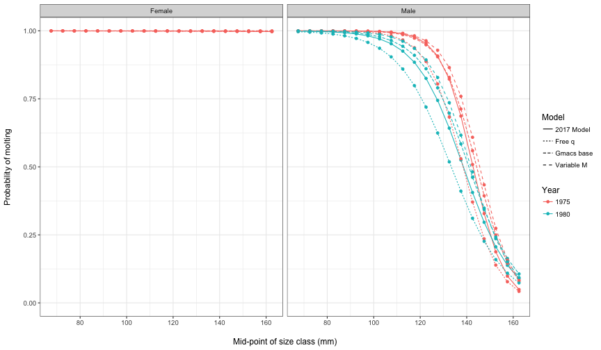

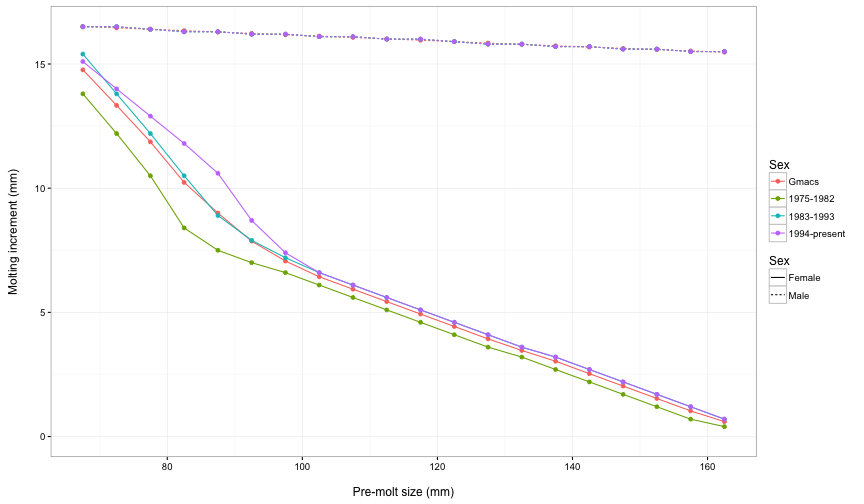

\newpage\clearpage

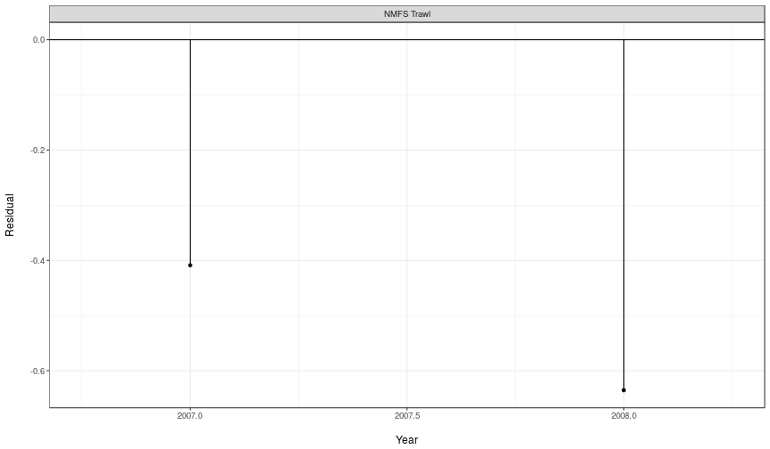

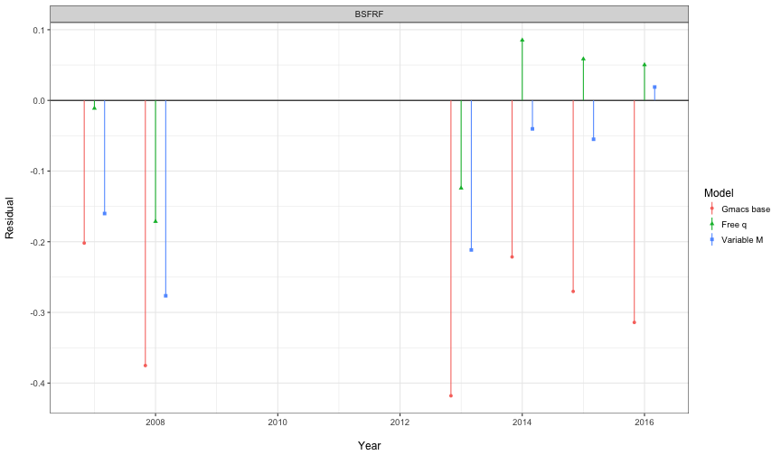

\newpage\clearpage

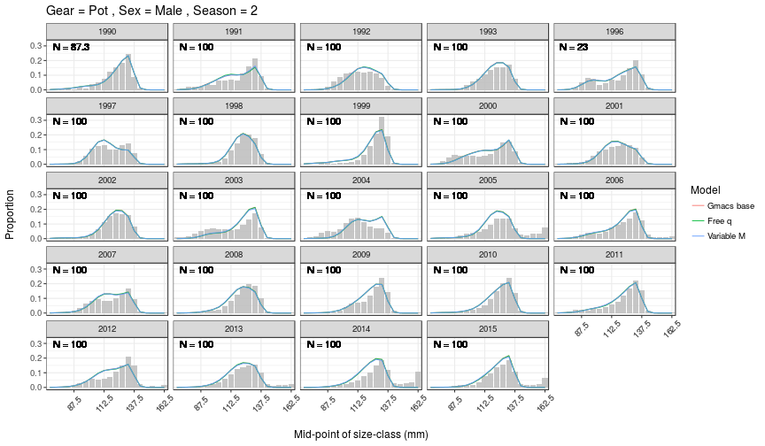

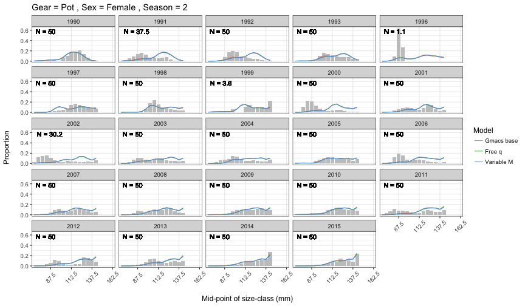

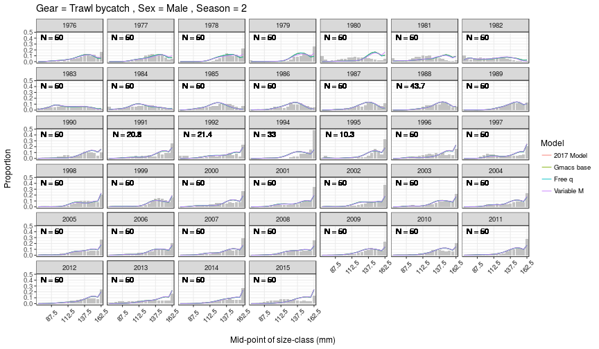

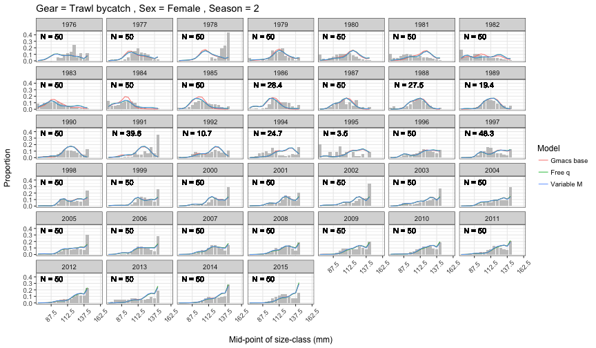

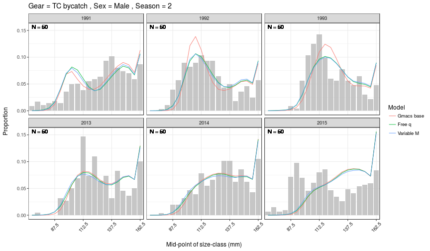

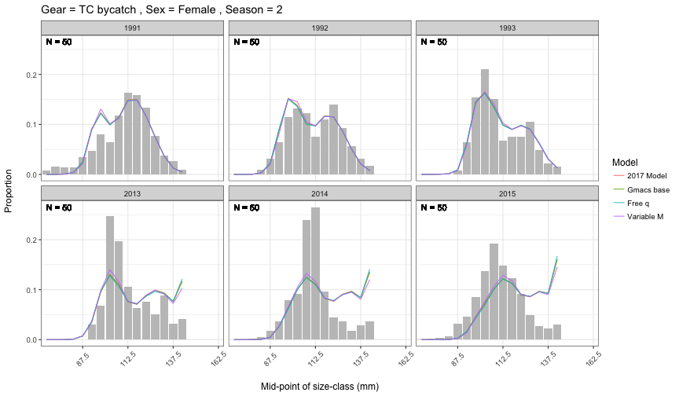

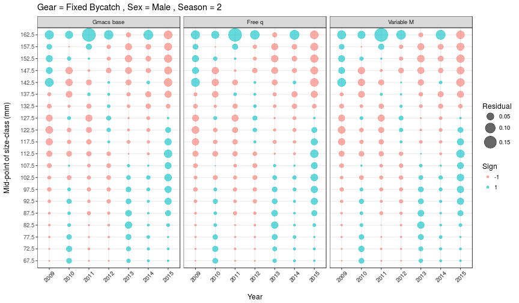

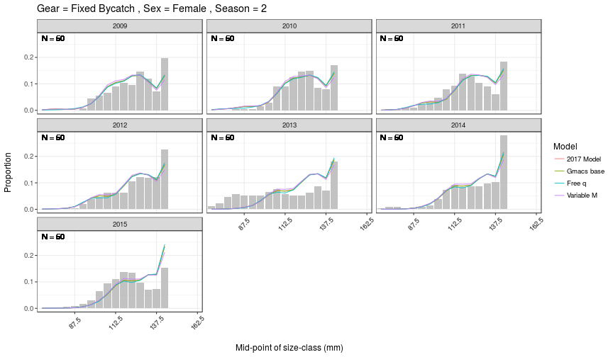

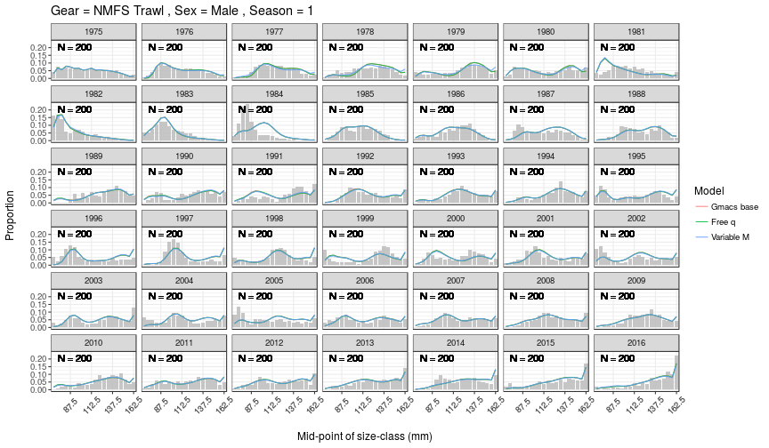

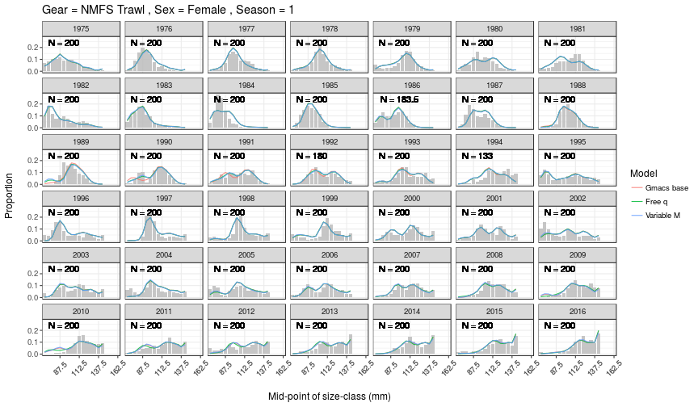

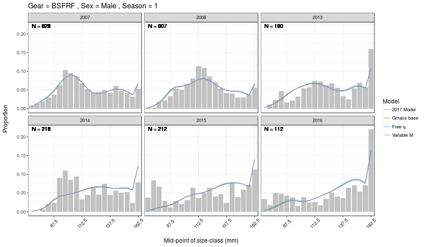

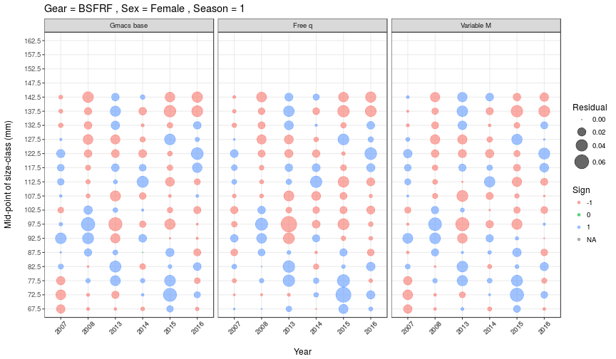

\newpage\clearpage

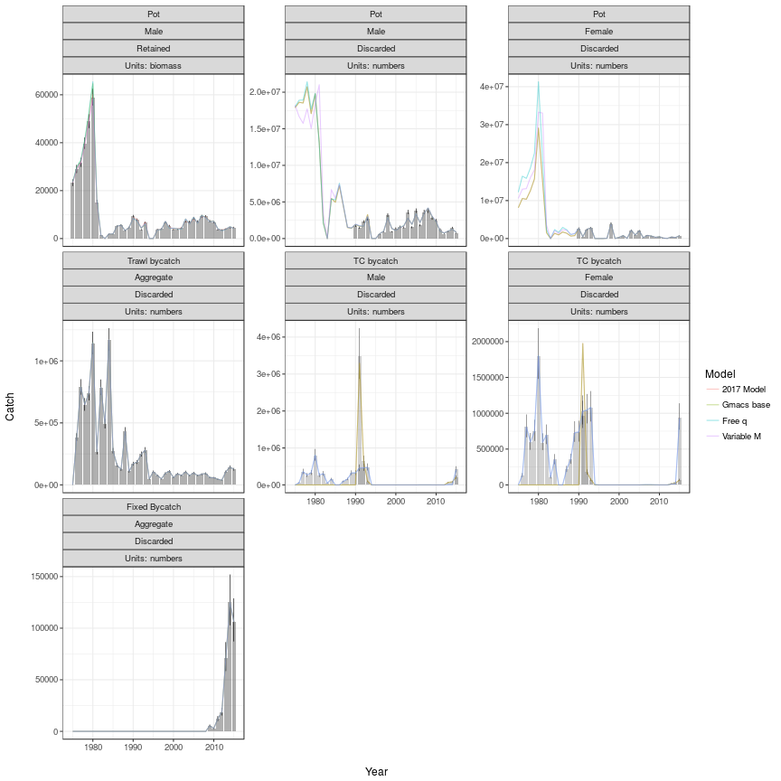

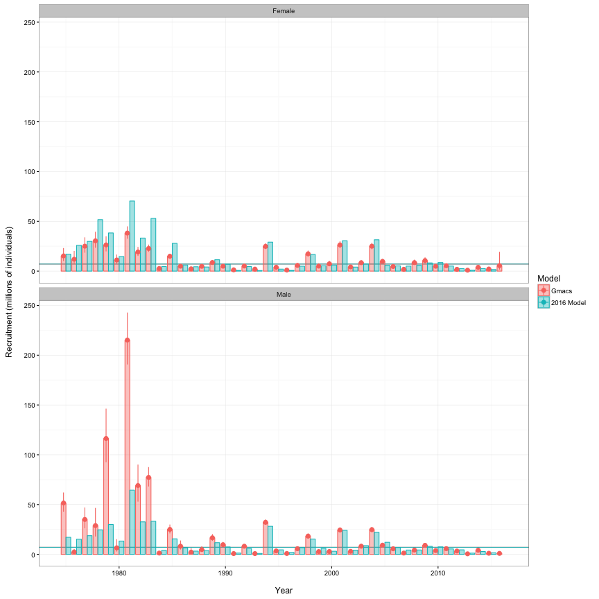

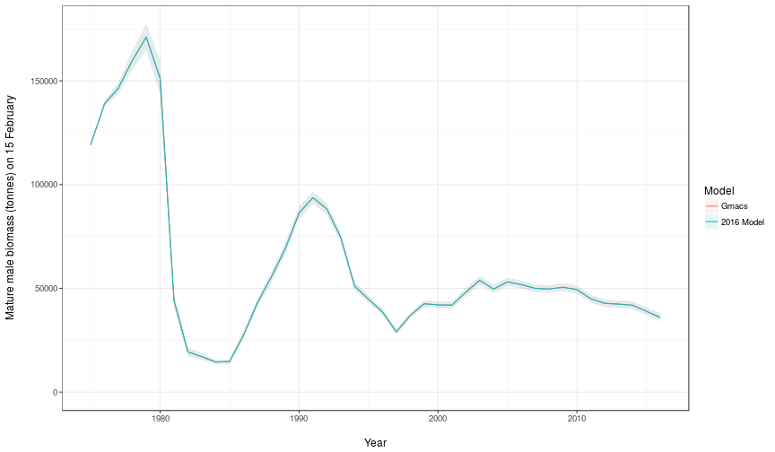

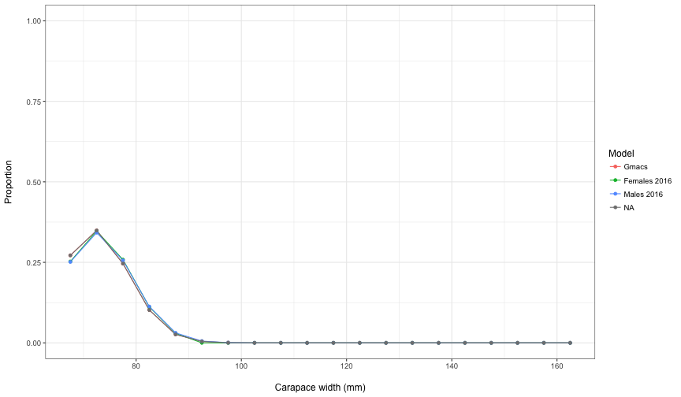

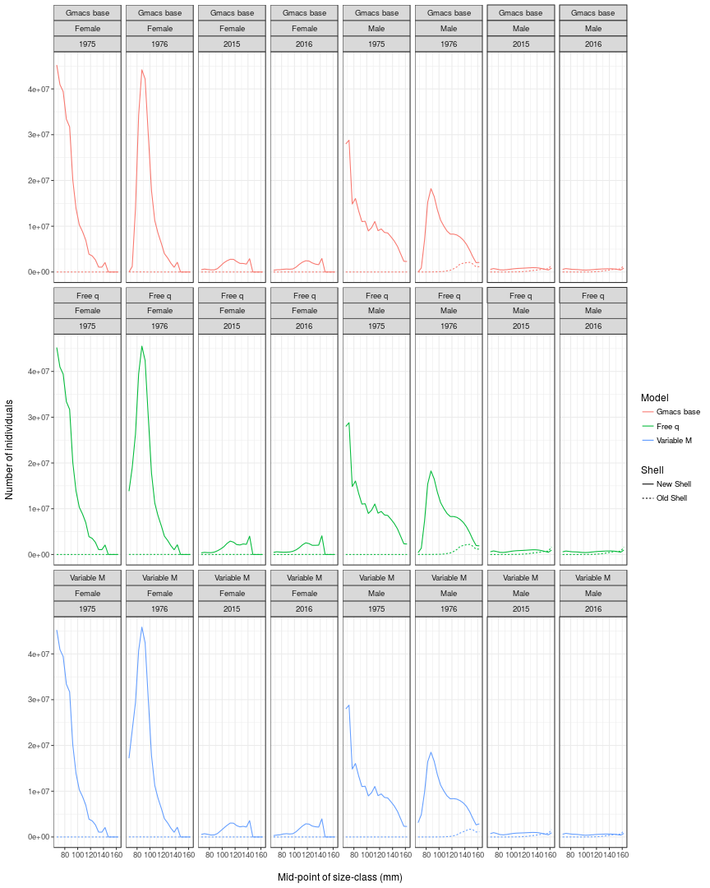

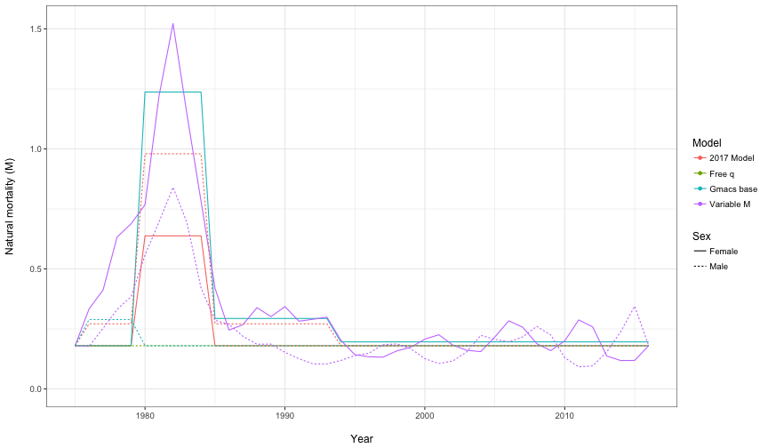

\newpage\clearpage

# Appendix A: BBRKC Model Description

## 1. Introduction

The Gmacs model has been specified to account for newshell and oldshell, 
male and female crab. These are partitioned into 20 stages (size-classes) 
determined by carapace length (CL) measurements from 65-70 mm through to 
160-165 mm. 

The following description of model structure reflects the Gmacs base model configuration.

## 2. Model Population Dynamics

Within the model, the beginning of the crab year is assumed contemporaneous
with the NMFS trawl survey, nominally assigned a date of 1 July. Although the
timing of the fishery is different each year, MMB is measured 15 February,
which is the reference date for calculation of federal management biomass
quantities. To accommodate this, each model year is split into 
4 seasons ($t$) and a proportion of the natural mortality
($\tau_t$) is applied in each of these seasons where $\sum_{t=1}^{t=4} \tau_t
= 1$. Each model year consists of the following processes: \begin{enumerate}
\item Season 1
\begin{itemize}
  \item Beginning of the BBRKC fishing year (1 July)
  \item $\tau_1 = 0.01$
  \item Surveys
\end{itemize}
\item Season 2
\begin{itemize}
  \item $\tau_2$ ranges from 0.2329 to 0.3507 depending on the time of year the fishery begins each
  year (i.e. a higher value indicates the fishery begins later in the year; see Table \ref{tab:bbrkc_fishery})
  \item Fishing mortality applied
\end{itemize}
\item Season 3
\begin{itemize}
  \item $\tau_3 = 1 - (\tau_1 + \tau_2 + \tau_4$)
  \item Calculate MMB (15 February)     
\end{itemize}
\item Season 4
\begin{itemize}
  \item $\tau_4 = 0.306$
  \item Growth and molting         
  \item Recruitment (all to stage-1)     
\end{itemize}     
\end{enumerate}
The proportion of natural mortality ($\tau_t$) applied during each season in the model is
provided in Table \ref{tab:m_prop}. The beginning of the year (1 July) to the
date that MMB is measured (15 February) is 63\% of the year. Therefore 63\% of
the natural mortality must be applied before the MMB is calculated. Because
the timing of the fishery is different each year $\tau_2$ is different each
year and thus $\tau_3$ differs each year.

\begin{table}[ht]
\centering
\caption{Proportion of the natural mortality ($\tau_t$) that is applied during each season ($t$) in the model.} 
\label{tab:m_prop}
\begin{tabular}{rrrrr}
  \hline
Year & Season 1 & Season 2 & Season 3 & Season 4 \\ 
  \hline
1975 & 0.01 & 0.23 & 0.45 & 0.31 \\ 
  1976 & 0.01 & 0.28 & 0.40 & 0.31 \\ 
  1977 & 0.01 & 0.32 & 0.36 & 0.31 \\ 
  1978 & 0.01 & 0.25 & 0.43 & 0.31 \\ 
  1979 & 0.01 & 0.25 & 0.43 & 0.31 \\ 
  1980 & 0.01 & 0.25 & 0.43 & 0.31 \\ 
  1981 & 0.01 & 0.25 & 0.43 & 0.31 \\ 
  1982 & 0.01 & 0.24 & 0.45 & 0.31 \\ 
  1983 & 0.01 & 0.24 & 0.44 & 0.31 \\ 
  1984 & 0.01 & 0.27 & 0.41 & 0.31 \\ 
  1985 & 0.01 & 0.24 & 0.44 & 0.31 \\ 
  1986 & 0.01 & 0.25 & 0.43 & 0.31 \\ 
  1987 & 0.01 & 0.25 & 0.43 & 0.31 \\ 
  1988 & 0.01 & 0.24 & 0.44 & 0.31 \\ 
  1989 & 0.01 & 0.25 & 0.43 & 0.31 \\ 
  1990 & 0.01 & 0.35 & 0.33 & 0.31 \\ 
  1991 & 0.01 & 0.34 & 0.34 & 0.31 \\ 
  1992 & 0.01 & 0.34 & 0.34 & 0.31 \\ 
  1993 & 0.01 & 0.35 & 0.34 & 0.31 \\ 
  1994 & 0.01 & 0.34 & 0.34 & 0.31 \\ 
  1995 & 0.01 & 0.34 & 0.34 & 0.31 \\ 
  1996 & 0.01 & 0.34 & 0.34 & 0.31 \\ 
  1997 & 0.01 & 0.34 & 0.34 & 0.31 \\ 
  1998 & 0.01 & 0.34 & 0.34 & 0.31 \\ 
  1999 & 0.01 & 0.30 & 0.38 & 0.31 \\ 
  2000 & 0.01 & 0.30 & 0.38 & 0.31 \\ 
  2001 & 0.01 & 0.30 & 0.38 & 0.31 \\ 
  2002 & 0.01 & 0.30 & 0.38 & 0.31 \\ 
  2003 & 0.01 & 0.30 & 0.38 & 0.31 \\ 
  2004 & 0.01 & 0.30 & 0.38 & 0.31 \\ 
  2005 & 0.01 & 0.30 & 0.38 & 0.31 \\ 
  2006 & 0.01 & 0.30 & 0.38 & 0.31 \\ 
  2007 & 0.01 & 0.30 & 0.38 & 0.31 \\ 
  2008 & 0.01 & 0.30 & 0.38 & 0.31 \\ 
  2009 & 0.01 & 0.30 & 0.38 & 0.31 \\ 
  2010 & 0.01 & 0.30 & 0.38 & 0.31 \\ 
  2011 & 0.01 & 0.30 & 0.38 & 0.31 \\ 
  2012 & 0.01 & 0.30 & 0.38 & 0.31 \\ 
  2013 & 0.01 & 0.30 & 0.38 & 0.31 \\ 
  2014 & 0.01 & 0.30 & 0.38 & 0.31 \\ 
  2015 & 0.01 & 0.30 & 0.38 & 0.31 \\ 
  2016 & 0.01 & 0.30 & 0.38 & 0.31 \\ 
   \hline
\end{tabular}
\end{table}

With boldface lower-case letters indicating vector quantities we designate the
vector of stage abundances during season $t$ and year $y$ as
\begin{equation}
    \boldsymbol{n}_{t,y} = n_{l,t,y} = \left[ n_{1,t,y}, n_{2,t,y}, \cdots, n_{L,t,y} \right]^\top.
\end{equation}

The number of new crab, or recruits, of each stage entering the model each
season $t$ and year $y$ is represented as the vector $\boldsymbol{r}_{t,y}$.
The BBRKC formulation of Gmacs specifies recruitment to several stages during
season $t=4$, thus the recruitment size distribution is
\begin{equation}
    \phi_l = \Gamma (\alpha, \beta),
\end{equation}
and the recruitment is
\begin{equation}
  \boldsymbol{r}_{t,y} = 
  \begin{cases}
    0 &\text{for} \quad t<4\\
    \bar{R} \phi_l \delta^R_y &\text{for} \quad t=4.
  \end{cases}
\end{equation}
where $\bar{R}$ is the average annual recruitment and $\delta^R_y$ are the recruitment deviations each year $y$
\begin{equation}
    \delta^R_y \sim \mathcal{N} \left( 0, \sigma_R^2 \right).
\end{equation}
Using boldface upper-case letters to indicate a matrix, we describe the size transition matrix $\boldsymbol{G}$ as
\begin{equation}
  \boldsymbol{G} = \left[ \begin{array}{ccc}
    1 - \pi_{12} - \pi_{13} & \pi_{12}     & \pi_{1\dots} \\
    0                       & 1 - \pi_{23} & \pi_{2\dots} \\
    0                       & \ddots       & \pi_{\dots\dots} \\
    0                       & 0            & 1 \end{array} \right],
\end{equation}
with $\pi_{jk}$ equal to the proportion of stage-$j$ crab that molt and grow into stage-$k$ within a season or year. 

The natural mortality each season $t$ and year $y$ is
\begin{equation}
    M_{t,y} = \bar{M} \tau_t + \delta_y^M \text{ where } \delta_y^M \sim \mathcal{N} \left( 0, \sigma_M^2 \right)
\end{equation}
Fishing mortality by year $y$ and season $t$ is denoted $F_{t,y}$ and calculated as
\begin{equation}
    F_{t,y} = F_{t,y}^\text{df} + F_{t,y}^\text{tb} + F_{t,y}^\text{tcb} + F_{t,y}^\text{fgb}
\end{equation}
where $F_{t,y}^\text{df}$ is the fishing mortality associated with the directed fishery, $F_{t,y}^\text{tb}$ is the fishing mortality associated with the trawl bycatch fishery, $F_{t,y}^\text{tc}$ is the fishing mortality associated with the tanner crab bycatch fishery, and $F_{t,y}^\text{fgb}$ is the fishing mortality associated with the fixed gear bycatch fishery. Each of these are derived as
\begin{align}
    F_{t,y}^\text{df} &= \bar{F}^\text{df} + \delta^\text{df}_{t,y} \quad \text{where} \quad \delta^\text{df}_{t,y} \sim \mathcal{N} \left( 0, \sigma^2_\text{df} \right), \notag\\
    F_{t,y}^\text{tb} &= \bar{F}^\text{tb} + \delta^\text{tb}_{t,y} \quad \text{where} \quad \delta^\text{tb}_{t,y} \sim \mathcal{N} \left( 0, \sigma^2_\text{tb} \right), \notag\\
    F_{t,y}^\text{tcb} &= \bar{F}^\text{tcb} + \delta^\text{tcb}_{t,y} \quad \text{where} \quad \delta^\text{tcb}_{t,y} \sim \mathcal{N} \left( 0, \sigma^2_\text{tcb} \right),\notag\\
    F_{t,y}^\text{fgb} &= \bar{F}^\text{fgb} + \delta^\text{fgb}_{t,y} \quad \text{where} \quad \delta^\text{fgb}_{t,y} \sim \mathcal{N} \left( 0, \sigma^2_\text{fgb} \right), 
\end{align}
where $\delta^\text{df}_{t,y}$, $\delta^\text{tb}_{t,y}$, $\delta^\text{tcb}_{t,y}$, and $\delta^\text{fgb}_{t,y}$ are the fishing mortality deviations for each of the fisheries, each season $t$ during each year $y$, $\bar{F}^\text{df}$, $\bar{F}^\text{tb}$, $\bar{F}^\text{tcb}$, and $\bar{F}^\text{fgb}$ are the average fishing mortalities for each fishery. The total mortality $Z_{l,t,y}$ represents the combination of natural mortality $M_{t,y}$ and fishing mortality $F_{t,y}$ during season $t$ and year $y$
\begin{equation}
    \boldsymbol{Z}_{t,y} = Z_{l,t,y} = M_{t,y} + F_{t,y}.
\end{equation}
The survival matrix $\boldsymbol{S}_{t,y}$ during season $t$ and year $y$ is
\begin{equation}
  \boldsymbol{S}_{t,y} = \left[ \begin{array}{ccccc}
    1-e^{-Z_{1,t,y}} & 0 & 0 & \cdots & 0 \\
    0 & 1-e^{-Z_{2,t,y}} & 0 & \cdots & 0 \\
    0 & 0 & 1-e^{-Z_{3,t,y}} & \cdots & 0 \\
    \vdots & \vdots & \vdots & \ddots & \vdots \\
    0 & \cdots & 0 & 0 & 1-e^{-Z_{L,t,y}} \end{array} \right].
\end{equation}

The basic population dynamics underlying Gmacs can thus be described as
\begin{align}
    \boldsymbol{n}_{t+1,y} &= \boldsymbol{S}_{t,y} \boldsymbol{n}_{t,y}, &\text{ if } t<4 \notag\\
    \boldsymbol{n}_{t,y+1} &= \boldsymbol{G} \boldsymbol{S}_{t,y} \boldsymbol{n}_{t,y} + \boldsymbol{r}_{t,y} &\text{ if } t=4.
\end{align}

## 3. Model Data

Data inputs used in model estimation are listed in Table \ref{tab:model_data}.
\begin{table}[ht]
\centering
\caption{Data inputs used in model estimation.} 
\label{tab:model_data}
\begin{tabular}{lll}
  \hline
  Data & Years & Source \\
  \hline
  Directed pot-fishery retained-catch number & 1978/79 - 1998/99 & Fish tickets \\
  (not biomass) & 2009/10 - 2015/16 & (fishery closed 1999/00 - 2008/09)\\
  \hline
  Groundfish trawl bycatch biomass & 1992/93 - 2015/16 & NMFS groundfish observer program \\
  \hline
  Groundfish fixed-gear bycatch biomass & 1992/93 - 2015/16 & NMFS groundfish observer program \\
  \hline
  NMFS trawl-survey biomass index & & \\
  (area-swept estimate) and CV & 1978-2016 & NMFS EBS trawl survey \\
  \hline
  BSFRF survey biomass abundance index & & \\
  (CPUE) and CV & Triennial 1995-2016 & BSFRF survey biomass \\
  \hline
  NMFS trawl-survey stage proportions & & \\
  and total number of measured crab & 1978-2016 & NMFS EBS trawl survey \\
  \hline
  BSFRF survey stage proportions & & \\
  and total number of measured crab & Triennial 1995-2016 & BSFRF survey \\
  \hline
  Directed pot-fishery stage proportions & 1990/91 - 1998/99 & ADF\&G crab observer program \\
  and total number of measured crab & 2009/10 - 2015/16 & (fishery closed 1999/00 - 2008/09) \\
  \hline
\end{tabular}
\end{table}

## 4. Model Parameters

Table \ref{tab:fixed_pars} lists fixed (externally determined) parameters used in model computations.
\begin{table}[ht]
\centering
\caption{Fixed model parameters for all scenarios.} 
\label{tab:fixed_pars}
\begin{tabular}{lccl}
  \hline
  Parameter & Symbol & Value & Source/rationale \\
  \hline
  BSFRF survey catchability & $q$ & 1.0 & Default \\
  Natural mortality & $M$ & 0.18 $\text{yr}^{-1}$ & NPFMC (2007) \\
  Weight at length & $w_l$ & - & Length-weight equation (B. Foy, NMFS) \\
  mean weights & & & applied to stage midpoints \\
  Recruitment SD & $\sigma_R$ & 1.2 & High value \\
  Natural mortality SD & $\sigma_M$ & 10.0 & High value (basically free parameter) \\
  Directed fishery & & 0.2 & 2010 Crab SAFE \\
  handling mortality & & & \\
  Groundfish trawl & & 0.8 & 2010 Crab SAFE \\
  handling mortality & & & \\
  Groundfish fixed-gear & & 0.5 & 2010 Crab SAFE \\
  handling mortality & & & \\
  \hline
\end{tabular}
\end{table}

Estimated parameters are listed in Table \ref{tab:bounds_pars} and include an estimated natural mortality deviation parameter in 1998/99 ($\delta^M_{1998}$) assuming an anomalous mortality event in that year, as hypothesized by Zheng and Kruse (2002), with natural mortality otherwise fixed at 0.18 $\text{yr}^{-1}$.
\begin{table}[ht]
\centering
\caption{The lower bound (LB), upper bound (UB), initial value, prior, and estimation phase for each estimated model parameter.} 
\label{tab:bounds_pars}
\begin{tabular}{lrrrlr}
  \hline
  Parameter & LB & Initial value & UB & Prior & Phase \\ 
  \hline
  Average recruitment $\log (\bar{R})$ & -10 & 14.0 & 20 & Uniform(-10,20) & 1 \\ 
  BSFRF trawl survey catchability $q$ & 0 & 4.0 & 5 & Uniform(0,5) & 1 \\ 
  Stage-1 directed fishery selectivity 1978-2008 & 0 & 0.4 & 1 & Uniform(0,1) & 3 \\ 
  Stage-2 directed fishery selectivity 1978-2008 & 0 & 0.7 & 1 & Uniform(0,1) & 3 \\ 
  Stage-1 directed fishery selectivity 2009-2015 & 0 & 0.4 & 1 & Uniform(0,1) & 3 \\ 
  Stage-2 directed fishery selectivity 2009-2015 & 0 & 0.7 & 1 & Uniform(0,1) & 3 \\ 
  Stage-1 NMFS trawl survey selectivity & 0 & 0.4 & 1 & Uniform(0,1) & 4 \\ 
  Stage-2 NMFS trawl survey selectivity & 0 & 0.7 & 1 & Uniform(0,1) & 4 \\ 
  Stage-1 ADF\&G pot survey selectivity & 0 & 0.4 & 1 & Uniform(0,1) & 4 \\ 
  Stage-2 ADF\&G pot survey selectivity & 0 & 0.7 & 1 & Uniform(0,1) & 4 \\ 
  Natural mortality deviation during 1998 $\delta^M_{1998}$ & -3 & 0.0 & 3 & Normal(0, $\sigma^2_M$) & 4 \\ 
  Recruitment deviations $\delta^R_y$ & -7 & 0.0 & 7 & Normal(0, $\sigma_R^2$) & 3 \\ 
  Average directed fishery fishing mortality $\bar{F}^\text{df}$                 & -  & 0.2 & - & - & 1 \\
  Average trawl bycatch fishing mortality $\bar{F}^\text{tb}$                 & -  & 0.001 & - & - & 1 \\
  Average fixed gear bycatch fishing mortality $\bar{F}^\text{fb}$                 & -  & 0.001 & - & - & 1 \\
  \hline
\end{tabular}
\end{table}

## 5. Model Objective Function and Weighting Scheme

The objective function consists of the sum of several "negative log-likelihood" terms characterizing the hypothesized error structure of the principal data inputs (Table \ref{tab:likelihood_components}). A lognormal distribution is assumed to characterize the catch data and is modelled as
\begin{align}
  \sigma_{t,y}^\text{catch} &= \sqrt{\log \left( 1 + \left( \mathit{CV}_{t,y}^\text{catch} \right)^2 \right)}\\
  \delta_{t,y}^\text{catch} &= \mathcal{N} \left( 0, \left( \sigma_{t,y}^\text{catch} \right)^2 \right)
\end{align}
where $\delta_{t,y}^\text{catch}$ is the residual catch. The relative abundance data is also assumed to be lognormally distributed
\begin{align}
  \sigma_{t,y}^\text{I} &= \frac{1}{\lambda} \sqrt{\log \left( 1 + \left( \mathit{CV}_{t,y}^\text{I} \right)^2 \right)}\\
  \delta_{t,y}^\text{I} &= \log \left( I^\text{obs} / I^\text{pred} \right) / \sigma_{t,y}^\text{I} + 0.5 \sigma_{t,y}^\text{I}
\end{align}
and the likelihood is
\begin{equation}
  \sum \log \left( \delta_{t,y}^\text{I} \right) + \sum 0.5 \left( \sigma_{t,y}^\text{I} \right)^2
\end{equation}

Gmacs calculates standard deviation of the normalised residual (SDNR) values
and median of the absolute residual (MAR) values for all abundance indices and
size compositions to help the user come up with resonable likelihood weights.
For an abundance data set to be well fitted, the SDNR should not be much
greater than 1 (a value much less than 1, which means that the data set is
fitted better than was expected, is not a cause for concern). What is meant by
"much greater than 1" depends on $m$ (the number of years in the data set).
Francis (2011) suggests upper limits of 1.54, 1.37, and 1.26 for $m$ = 5, 10,
and 20, respectively. Although an SDNR not much greater than 1 is a necessary
condition for a good fit, it is not sufficient. It is important to plot the
observed and expected abundances to ensure that the fit is good.

Gmacs also calculates Francis weights for each of the size composition data
sets supplied (Francis 2011). If the user wishes to use the Francis iterative
re-weighting method, first the weights applied to the abundance indices should
be adjusted by trial and error until the SDNR (and/or MAR) are adequte. Then
the Francis weights supplied by Gmacs should be used as the new likelihood
weights for each of the size composition data sets the next time the model is
run. The user can then iteratively adjust the abundance index and size
composition weights until adequate SDNR (and/or MAR) values are achieved,
given the Francis weights.

## 6. Estimation

The model was implemented using the software AD Model Builder (Fournier et al.
2012), with parameter estimation by minimization of the model objective
function using automatic differentiation. Parameter estimates and standard
deviations provided in this document are AD Model Builder reported values
assuming maximum likelihood theory asymptotics.
