The following summarizes the outcome of some comparisons between the existing
Bristol Bay red king crab (BBRKC) stock assessment model [@zheng_bristol_2014]
(Zheng et al. 2014) and an emulated version using the gmacs platform.  Since the
BBRKC model from Zheng et al. (2014) treats recruits by sex along with
sex-specific natural mortality and fishing mortality, results from the male
components are compared with results from a `gmacs` model implementation tuned
to male-only data.

# Size specific schedules

## Mean weight-at-length

The mean weight-at-length ($w_\ell$) of crabs is defined in grams and the
carapace length ($\ell$, CL) in mm. The mean weight-at-length used in both
models is nearly identical (Figure \ref{fig:mean_wt}). The only difference
between the two models is in the final length class (160mm) where the mean
weight is greater in Zheng's model than in gmacs.

The length-weight relationships used in Zheng's model for males and females were
$$W = 0.000408 L^{3.127956} \quad \text{immature females},$$
$$W = 0.003593 L^{2.666076} \quad \text{ovigerous females},$$
$$W = 0.0004031 L^{3.141334} \quad \text{males}.$$

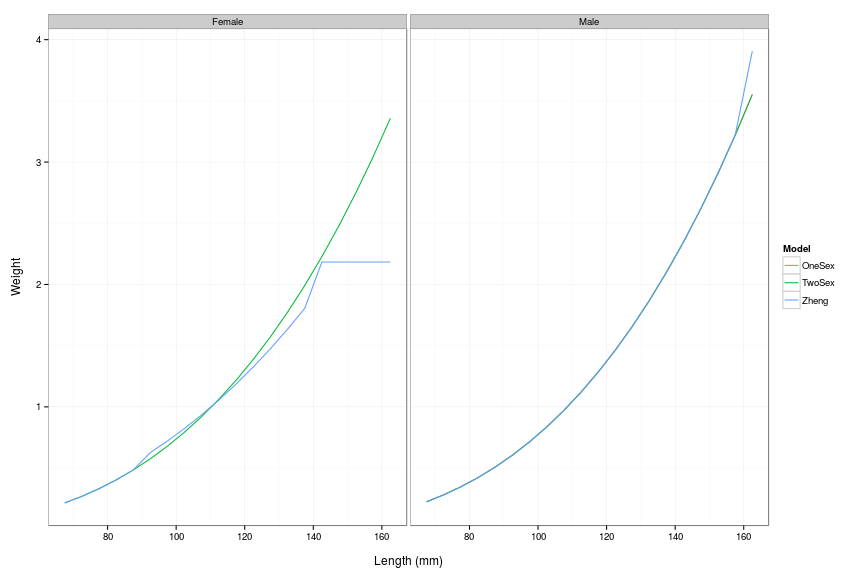 

  
## Initial recruitment size distribution

Gmacs was configured to match the Zheng et al. (2014) model closely and this was
achieved (Figure \ref{fig:init_rec}).

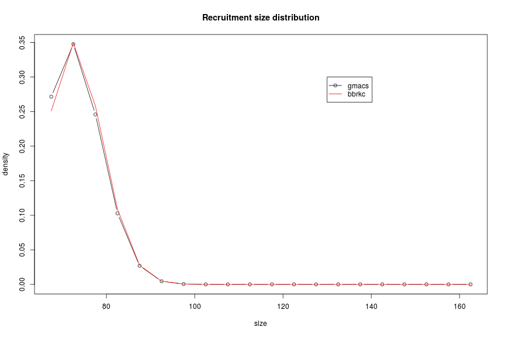 

## Molting increment width

Options to fit relationship based on data was developed but for the BBRKC
system, a size-specific vector was used to determine molt increments as show
below (Figure \ref{fig:growth_inc}).

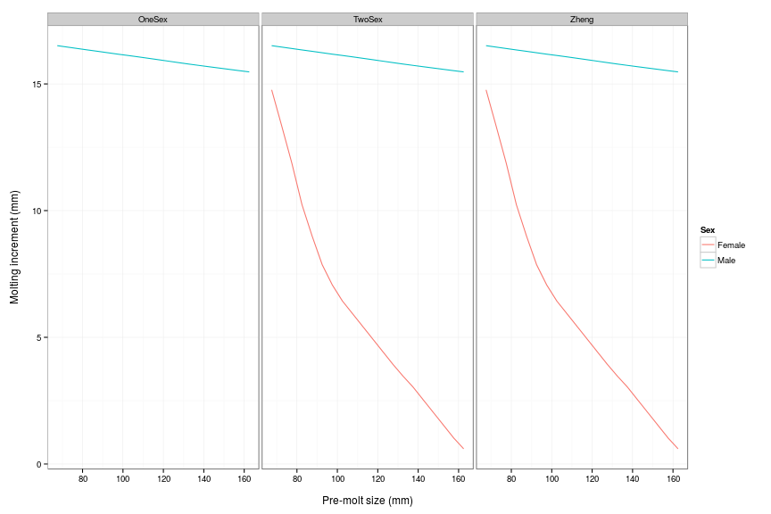 

## Molting probability

Fixed parameters in gmacs were easily set to represent that assumed from Zheng
et al. (2014) (Figure \ref{fig:molt_prob}).

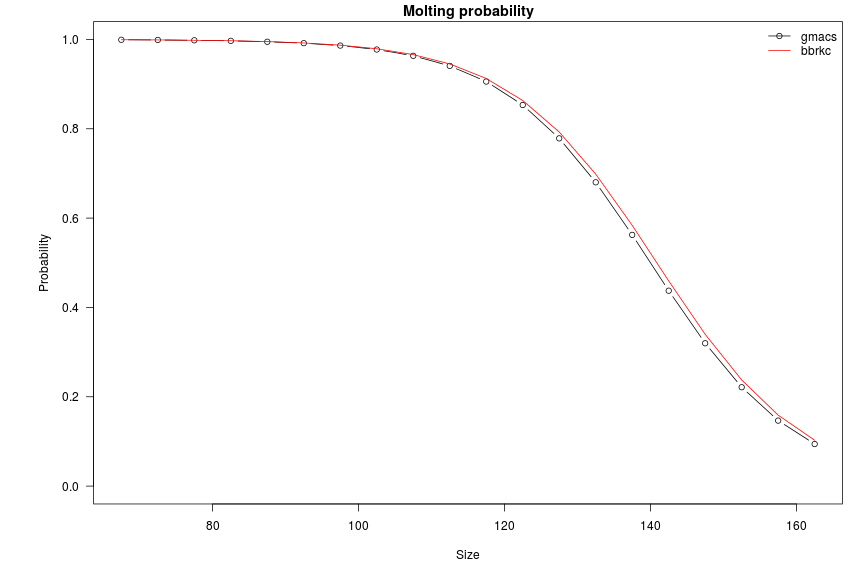 

## Transition processes

The first set of figures is the growth probabilities (for all crabs that molt)
(Figure \ref{fig:growth_trans}).

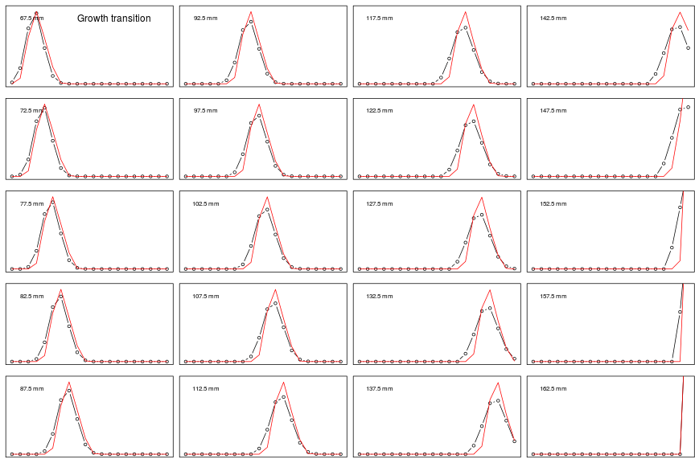 

The second set of figures is the combination of growth and molting and
represents the size transition (Figure \ref{fig:size_trans}).

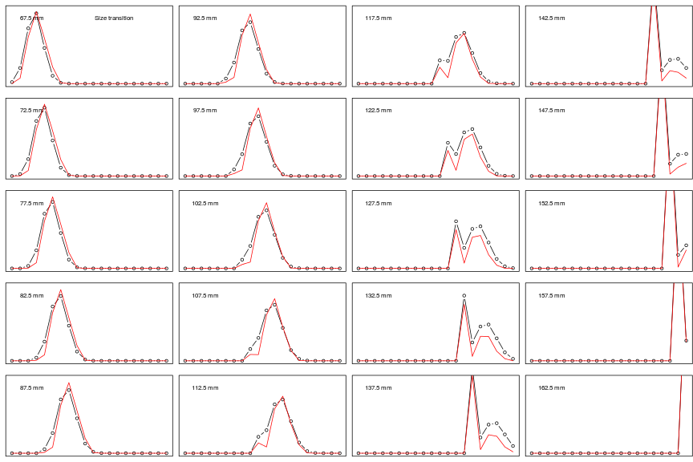 

## Numbers at length in 1975

The scale of these results differ significantly and may be related to the
interaction with natural mortality estimates and how the initial
population-at-lengths were established (the BBRKC model assumes all new-shell)
(Figure \ref{fig:init_N}).

 
 
# Time series results/comparisons

## Natural mortality

The figure below illustrates implementation of four step changes in $M_t$
(freely estimated) in gmacs relative to the estimates from Zheng et al. 2014
(Figure \ref{fig:M_t}).

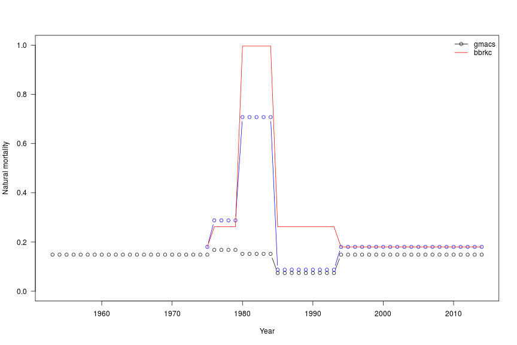 

## Recruitment

Recruitment patterns are similar, but differences in natural mortality schedules
will affect these matches. The figure below plots the values to have the same
mean (Figure \ref{fig:recruits}).

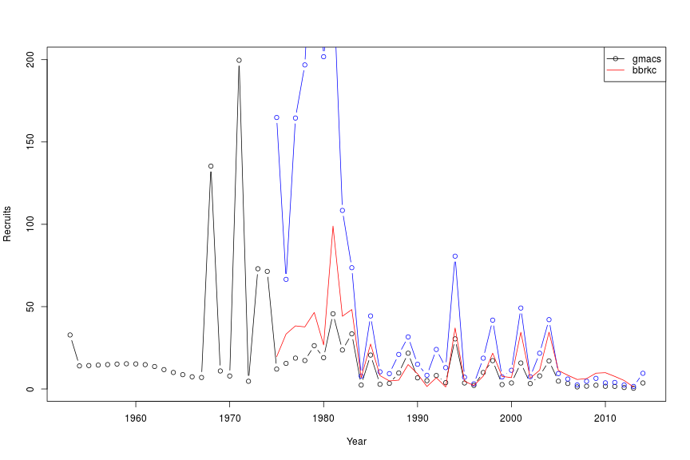 

## Fit to survey abundance indices

The model fit to survey biomass (males) was better for the current model (at
least visually) than for the current implementation of gmacs (Figure
\ref{fig:survey_biomass}).

 

 
## Estimated retained catch and discards, for whole period

This figure summarizes the observed (horizontal) and predicted (vertical)
catches by gear type. Data for discard fisheries were read in with 100%
mortality (as clarified in Table 1 of Zheng et al. 2014) (Figure
\ref{fig:fit_to_catch}).

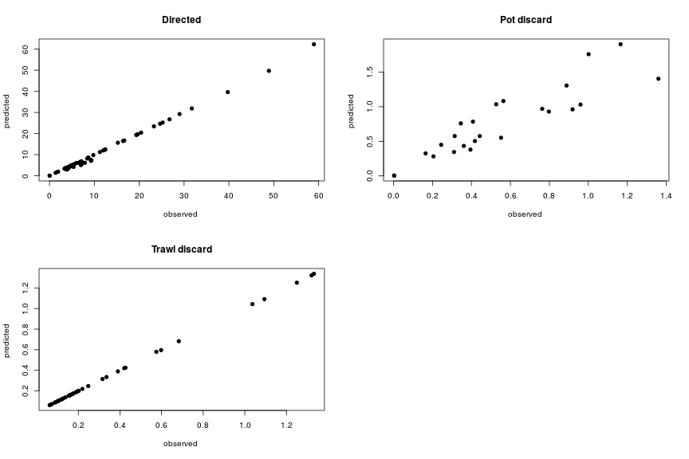 

# Other diagnostics

## Fit to size frequency data

The subsequent figures provide fits to the male BBRKC data based on gmacs
(Figure \ref{fig:sizecomps}).

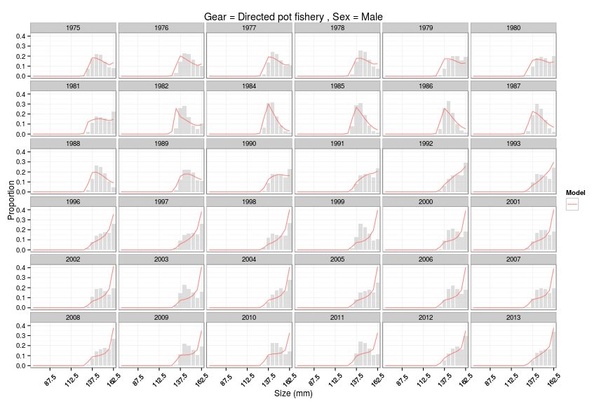 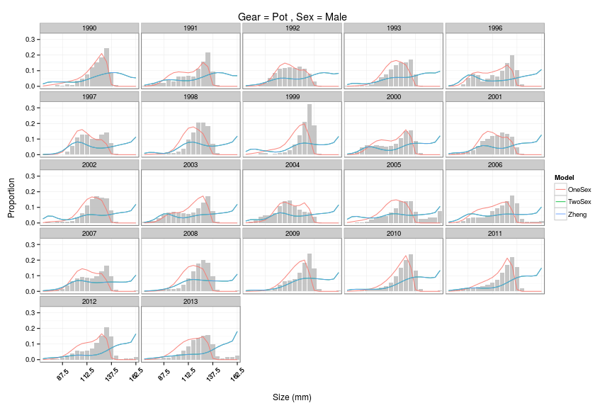 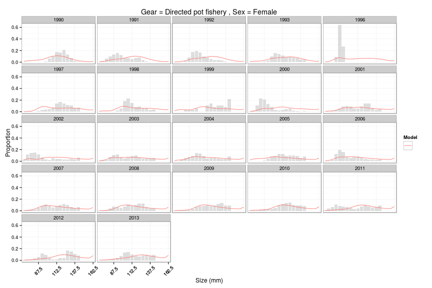 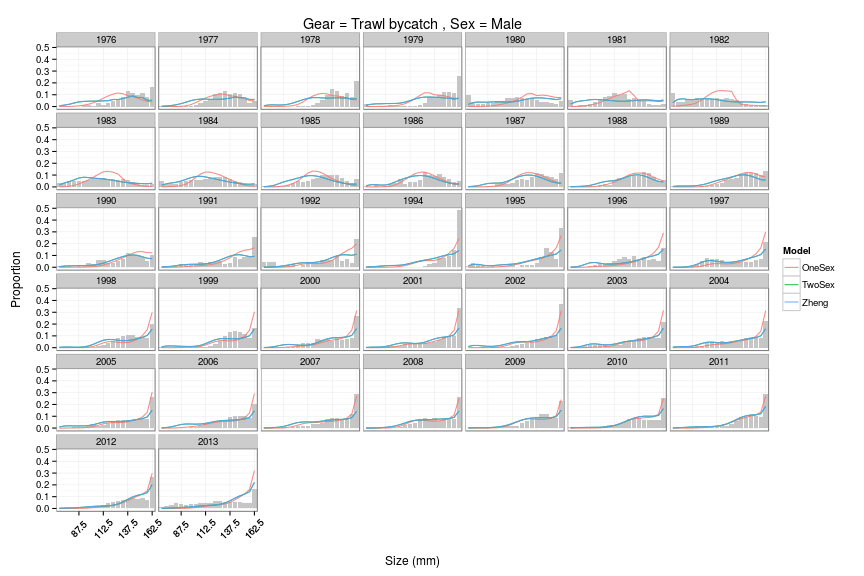 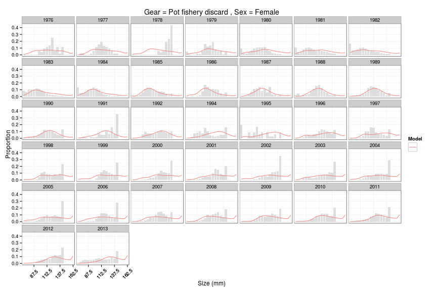 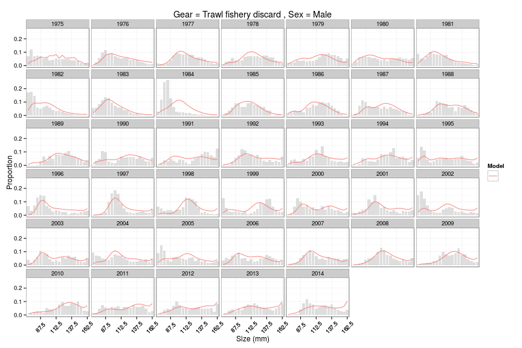 

# Summary

Comparisons of actual likelihood function values and year-specific fits using
the robust-multinomial would be the next step after selectivity issues are
resolved. Subsequent to that, it would be worth exploring aspects of alternative
model specifications (e.g., constant natural mortality over time, time-varying
selectivity, etc) to evaluate sensitivities.

# References
